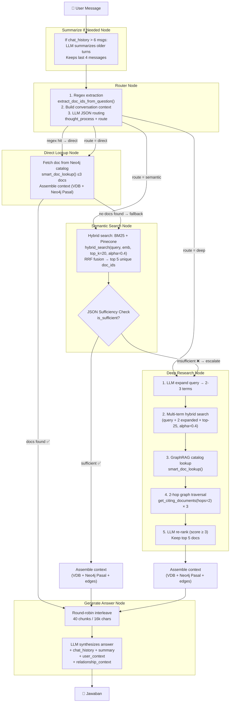

# Chatbot — Pipeline Documentation

> GraphRAG Conversational Legal AI Assistant  
> ChatGPT-style multi-turn Q&A with persistent memory  
> **v3 — LangGraph Agentic Router + Hybrid BM25 + Conversation Memory**

---

## Architecture Overview

```
┌──────────────────┐    ┌────────────────────────────────────────────────────────┐
│  Streamlit Chat   │───▶│              LangGraph StateGraph (6 nodes)            │
│  (app.py)         │◀───│  ┌───────────┐  ┌────────┐  ┌──────────┐  ┌────────┐ │
│                   │    │  │ Summarize │─▶│ Router │─▶│ Direct / │─▶│ Gen    │ │
│  • chat_input()   │    │  │IfNeeded   │  │  Node  │  │ Semantic/│  │ Answer │ │
│  • thread_id      │    │  │ (memory)  │  │        │  │  Deep    │  │  Node  │ │
│  • narratives     │    │  └───────────┘  └────────┘  └──────────┘  └────────┘ │
│  • sidebar history│    └────────────────────────────────────────────────────────┘
└──────────────────┘           │              │              │
       │                 ┌─────┴──────┐ ┌─────┴──────┐ ┌────┴─────┐
       │                 │ OpenRouter  │ │ Hybrid     │ │  Neo4j   │
       │                 │ (Claude)    │ │ Search     │ │  Aura    │
       │                 │ • route     │ │ • BM25     │ │ • docs   │
       │                 │ • suffice   │ │ • Pinecone │ │ • CITES  │
       │                 │ • rerank    │ │ • RRF      │ │ • HIGHER │
       │                 │ • answer    │ │ • 1024-dim │ │ • Pasal  │
       │                 │ • summarize │ │            │ │          │
       │                 └─────────────┘ └────────────┘ └──────────┘
       │                                       ▲
       │                                       │
       │                                ┌──────────────┐
       │                                │ HuggingFace  │
       │                                │ Indo-Legal   │
       │                                │ BERT-V3      │
       │                                │ (embedding)  │
       │                                └──────────────┘
       │
       ▼
┌──────────────────────────────────────────┐
│         Persistence Layer                │
│  ┌──────────────┐  ┌──────────────────┐  │
│  │ SqliteSaver   │  │ SemanticMemory   │  │
│  │ (checkpointer)│  │ (query log,      │  │
│  │ • chat_history│  │  user context,   │  │
│  │ • summary     │  │  conv titles)    │  │
│  │ • thread_id   │  │                  │  │
│  └──────────────┘  └──────────────────┘  │
│            graphrag_memory.db            │
└──────────────────────────────────────────┘
       │
       ▼
┌──────────────────────┐     ┌──────────────────────┐
│  LangSmith (opt.)    │     │  AWS S3               │
│  • Tracing           │     │  • PDF pre-signed URL │
└──────────────────────┘     └──────────────────────┘
```

**Services:**

| Service | Purpose | Env Var |
|---------|---------|---------|
| Neo4j Aura | Graph DB — documents, citations, hierarchy | `NEO4J_URI`, `NEO4J_USER`, `NEO4J_PASSWORD` |
| Pinecone | Vector DB — dense semantic search over legal chunks | `PINECONE_API_KEY`, `PINECONE_INDEX` |
| HuggingFace | Embedding endpoint — Indo-LegalBERT-V3 (1024-dim) | `HF_AUTH_TOKEN`, `HF_ENDPOINT_URL` |
| OpenRouter | LLM gateway — Claude Sonnet for reasoning & routing | `OPENROUTER_API_KEY`, `LLM_MODEL` |
| OpenRouter (Router) | Optional separate model for routing decisions | `LLM_ROUTER_MODEL` (fallback: `LLM_MODEL`) |
| BM25 Index | In-memory keyword search index built from Pinecone corpus | `chatbot/bm25_corpus.json` (auto-cached) |
| SQLite | Persistence — checkpoints + semantic memory | `graphrag_memory.db` (auto-created) |
| LangSmith (optional) | Observability — tracing, evaluation | `LANGSMITH_API_KEY`, `LANGCHAIN_PROJECT` |
| AWS S3 | Document PDF storage — pre-signed URLs | `AWS_ACCESS_KEY_ID`, `AWS_SECRET_ACCESS_KEY`, `AWS_REGION` |

---

## Key Differentiators (vs. Search App)

| Feature | Chatbot | Search |
|---------|---------|--------|
| **UI** | ChatGPT-style multi-turn conversation | Single-query tabbed interface |
| **Conversation Memory** | `SqliteSaver` checkpointer + summary condensation | None |
| **Semantic Memory** | `SemanticMemory` (query log, frequent topics/docs, user context) | None |
| **Conversation History** | Sidebar with 20 past conversations, resumable by `thread_id` | None |
| **Retrieval** | Hybrid BM25 + Dense (RRF fusion, alpha=0.4) | Dense-only Pinecone |
| **LangGraph Nodes** | 6 nodes (includes `summarize_if_needed`) | 5 nodes |
| **Answer Generation** | Includes `chat_history`, `summary`, `user_context` in LLM prompt | Single-turn context only |
| **Max Chunks** | 40 chunks / 16k chars | 40 chunks / 16k chars |
| **Graph Visualization** | `streamlit-agraph` relationship graph per answer | Same |
| **Knowledge Map** | No | No (see `search_km` for KM) |

---

## Pipeline Flow (LangGraph Agentic Router)

The pipeline is implemented as a **LangGraph `StateGraph`** with 6 nodes, conditional edges, and **persistent memory**. A `Summarize-If-Needed` node condenses older conversation history. An LLM **Router Node** classifies each query into one of three routes. Both `semantic_search` and `deep_research` nodes use **hybrid BM25 + dense** retrieval with Reciprocal Rank Fusion.



### LangGraph State

```python
class GraphState(TypedDict):
    query: str                          # User question
    route: str                          # "direct" | "semantic" | "deep"
    primary_doc_ids: List[str]          # Final document IDs for answer
    context_docs: Dict[str, dict]       # {doc_id: {source, chunks[]}}
    relationship_context: str           # CITES/HIGHER edge text
    answer: str                         # Final generated answer
    logs: List[str]                     # System debug logs
    narratives: List[str]               # User-facing legal explanations (Indonesian)
    chat_history: List[dict]            # [{role: "user"|"assistant", content: str}]
    summary: str                        # Condensed older conversation history
    user_context: str                   # Injected semantic memory context
```

### Graph Edges (Routing Logic)

```python
workflow = StateGraph(GraphState)

# 6 Nodes
workflow.add_node("summarize_if_needed", summarize_if_needed_node)
workflow.add_node("router", router_node)
workflow.add_node("direct_lookup", direct_lookup_node)
workflow.add_node("semantic_search", semantic_search_node)
workflow.add_node("deep_research", deep_research_node)
workflow.add_node("generate_answer", generate_answer_node)

# Entry — summarize first, then route
workflow.set_entry_point("summarize_if_needed")
workflow.add_edge("summarize_if_needed", "router")

# Router → one of three processing nodes
workflow.add_conditional_edges("router", router_condition)

# Direct → answer OR fallback to semantic
workflow.add_conditional_edges("direct_lookup", route_after_direct)

# Semantic → answer OR escalate to deep
workflow.add_conditional_edges("semantic_search", route_after_semantic)

# Deep always → answer
workflow.add_edge("deep_research", "generate_answer")
workflow.add_edge("generate_answer", END)

# Compile with optional checkpointer for conversation persistence
compile_kwargs = {}
if checkpointer is not None:
    compile_kwargs["checkpointer"] = checkpointer
return workflow.compile(**compile_kwargs)
```

---

## Node-by-Node Detail

### Summarize-If-Needed Node — `summarize_if_needed_node()`

| Step | Function | Service | Cost |
|------|----------|---------|------|
| 1. Check history length | `len(chat_history) > 6` | Local | Free |
| 2. Summarize older turns | `summarize_conversation(older, existing_summary)` | OpenRouter | ~300 tokens |

**Entry point** of the graph. Manages the conversation context window:
- If `chat_history` ≤ 6 messages → pass-through
- If > 6 messages → condense older turns into 3-5 sentences (Indonesian), keep last 4 messages intact
- Updates `summary` field in state

### Router Node — `router_node()`

| Step | Function | Service | Cost |
|------|----------|---------|------|
| 1. Regex extraction | `extract_doc_ids_from_question(query)` | Local | Free |
| 2. Build conversation context | `_build_history_context(state)` | Local | Free |
| 3. LLM route decision | `client.chat.completions.create()` | OpenRouter | ~250 tokens |

**Step 1:** Parses explicit references like "PP 34/2021" → `PP-NASIONAL-34-2021`. If regex hit → route = `"direct"`.

**Step 2:** Builds compact context from `summary` + last 6 messages for the LLM router.

**Step 3:** LLM returns JSON with `thought_process` (streamed as narrative) and `route` ("direct" | "semantic" | "deep").

**Fallback:** On any error, defaults to `"semantic"`.

### Direct Lookup Node — `direct_lookup_node()`

| Function | Service | Cost |
|----------|---------|------|
| `get_all_documents()` | Neo4j (cached 1hr) | 1 Cypher query |
| `smart_doc_lookup(query, all_docs)` | OpenRouter | ~400 tokens |
| `_assemble_context_for_state()` | Neo4j + Pinecone | N queries |

1. If no regex-extracted doc_ids, uses `smart_doc_lookup()` to pick ≤3 docs from Neo4j catalog.
2. If still empty → fallback to `semantic`.
3. Otherwise assembles context and proceeds to answer.

### Semantic Search Node — `semantic_search_node()`

| Step | Function | Service | Cost |
|------|----------|---------|------|
| 1. Hybrid search | `get_embedding()` + `hybrid_search(top_k=20, alpha=0.4)` | HF + Pinecone + BM25 | 2 API calls + local |
| 2. Sufficiency check | `client.chat.completions.create()` | OpenRouter | ~250 tokens |
| 3. Context assembly | `_assemble_context_for_state()` | Neo4j | N queries |

**Step 1 — Hybrid Search (BM25 + Dense + RRF):**
```python
emb = llm_stance.get_embedding(query)
raw = hybrid_search(query, emb, top_k=20, alpha=0.4)
# alpha=0.4 → 60% BM25 weight, 40% dense weight
```

The hybrid search fuses Pinecone dense cosine results with BM25 keyword results using Reciprocal Rank Fusion (RRF). This solves the "Cukup jelas" problem where dense-only search returns semantically similar but substantively irrelevant short chunks.

**Step 2:** LLM judges if retrieved context is sufficient. If not → escalate to `deep`.

**Step 3:** Assembles full context with Neo4j Pasal/Ayat data.

### Deep Research Node — `deep_research_node()`

| Step | Function | Service | Cost |
|------|----------|---------|------|
| 1. Query expansion | `expand_query(query)` | OpenRouter | ~250 tokens |
| 2. Multi-term hybrid search | `hybrid_search()` × 3 (top_k=25, alpha=0.4) | HF + Pinecone + BM25 | 6 API calls + local |
| 3. Graph catalog lookup | `smart_doc_lookup()` | Neo4j + OpenRouter | ~400 tokens |
| 4. 2-hop traversal | `get_citing_documents(hops=2)` × 3 | Neo4j | 3 Cypher queries |
| 5. Re-ranking | `rerank_documents(query, summaries)` | OpenRouter | ~300 tokens |
| 6. Context assembly | `_assemble_context_for_state()` | Neo4j | N queries |

Uses the same hybrid search as semantic node but with expanded queries and higher `top_k=25`. Graph traversal discovers connected regulations the user didn't mention.

### Generate Answer Node — `generate_answer_node()`

| Step | Function | Service | Cost |
|------|----------|---------|------|
| 1. Interleave context | `_build_interleaved_context()` | Local | Free |
| 2. Generate answer | `ask_about_documents(query, chunks, rel_ctx, chat_history, summary, user_context)` | OpenRouter | ~1500-2000 tokens |
| 3. Update chat history | Append user + truncated answer (500 chars) | Local | Free |

**Conversation-aware generation:** Unlike the search app, the chatbot's answer generation includes:
- `chat_history` — last 6 messages for immediate context
- `summary` — condensed older conversation for continuity
- `user_context` — frequent topics/docs from SemanticMemory

This enables multi-turn follow-up questions like "dan bagaimana dengan pasal 5-nya?" to resolve correctly.

---

## Hybrid BM25 Search — `shared/bm25_index.py`

### Why Hybrid?

Dense embedding (Indo-LegalBERT-V3) produces saturated cosine scores (0.975–0.995) for Indonesian legal text, making it impossible to discriminate relevant from irrelevant chunks. BM25 provides keyword-exact signal that breaks through score compression.

### Architecture

```
Query: "apa itu bangunan?"
     │
     ├──── Dense Path ────────────────────────────┐
     │     get_embedding() → Pinecone top-60       │
     │     Returns: [{id, score, doc_id, content}] │
     │                                              │
     ├──── BM25 Path ─────────────────────────────┐│
     │     _tokenize(query) → BM25Okapi.get_scores ││
     │     Returns: [(id, bm25_score)]              ││
     │                                              ││
     └──── RRF Fusion ─────────────────────────────┘│
           For each result:                          │
             score[id] += alpha / (k + rank + 1)     │  ← dense
             score[id] += (1-alpha) / (k + rank + 1) │  ← BM25
           Sort by fused score → top-k               │
```

### Configuration

| Parameter | Value | Explanation |
|-----------|-------|-------------|
| `alpha` | 0.4 | 60% BM25 weight, 40% dense. BM25-heavy because dense scores are saturated. |
| `k` (RRF) | 60 | Standard RRF smoothing constant |
| Dense `top_k` | `max(top_k * 3, 50)` | Over-retrieve for fusion |
| BM25 `top_k` | `max(top_k * 3, 50)` | Over-retrieve for fusion |

### BM25 Corpus

- **Source:** All 4649 vectors downloaded from Pinecone `lexport-trial` index
- **Cache:** `chatbot/bm25_corpus.json` (auto-built on first run, ~377s; subsequent loads ~0.11s)
- **Tokenizer:** Custom Indonesian tokenizer with legal stop-word removal (`sebagaimana`, `dimaksud`, `ketentuan`, `peraturan`, etc.)
- **Refresh:** Call `refresh_cache()` when new documents are added to Pinecone

---

## Streamlit UI (app.py)

### Session State

```python
{
    "messages": [],              # [{role, content, doc_ids?, latency?, logs?}]
    "active_conv_id": uuid(),    # Current conversation thread_id
    "feedback_given": set(),     # Track liked/disliked messages
    "chat_history": [],          # [{role: "user"|"assistant", content: str}]
    "summary": "",               # Condensed older conversation
}
```

### Chat Flow

```python
# 1. User types message
prompt = st.chat_input("Tanyakan sesuatu tentang regulasi...")

# 2. Initialize LangGraph with checkpointer
agent = create_agent(checkpointer=_checkpointer)
user_ctx = semantic_memory.get_user_context_prompt()

# 3. Stream execution with conversation persistence
for event in agent.stream(
    {"query": prompt, "chat_history": chat_history, "summary": summary,
     "user_context": user_ctx, "logs": [], "narratives": [], "primary_doc_ids": []},
    config={"configurable": {"thread_id": active_conv_id}},
):
    # Live render narratives
    for narrative in new_narratives:
        st.markdown(f"*{narrative}*")

# 4. Parse DASAR_HUKUM footer for cited doc_ids
# 5. Render answer + doc cards + feedback buttons
# 6. Log to semantic memory
semantic_memory.log_query(query=prompt, doc_ids=cited_ids, route=route, latency=latency)
```

### Sidebar

- **Brand header** — "Graph" + "RAG" with gradient
- **"Obrolan Baru"** — Creates new conversation with fresh `thread_id`
- **Connection status** — Neo4j + Pinecone health check (green/red dots)
- **Chat history** — Last 20 conversations from SQLite, click to resume

### Answer Rendering

- Markdown with section icons (🏛️ Kesimpulan, 📋 Dasar Hukum)
- Latency badge
- Legal disclaimer (AI-generated, bukan nasihat hukum resmi)
- Expandable doc cards (color-coded by type: UU=blue, PP=green, Permen=orange)
- PDF link via S3 pre-signed URL (1-hour expiry)
- "Salin Sitasi" button
- Feedback buttons (👍 / 👎)

---

## Memory Architecture

| Scope | Storage | Purpose | Lifecycle |
|-------|---------|---------|-----------|
| Conversation Memory | LangGraph SqliteSaver (checkpointer) | `chat_history` per thread_id | Persists across browser reloads |
| Summary Memory | `summary` field in GraphState | Condensed older turns (>6 msgs) | Updated each turn |
| Semantic Memory | `SemanticMemory` SQLite tables | Query log, frequent topics/docs | Persists forever |
| Cross-Session | `conv_title:*` keys in semantic_memory | Sidebar conversation history | Persists forever |

### SemanticMemory Class

```python
class SemanticMemory:
    def __init__(self, db_path="graphrag_memory.db")

    # Tables: query_log, semantic_memory (key-value)
    def log_query(query, doc_ids, topic, route, latency)  # Log each answered query
    def get_recent_queries(n)         # Last N queries with metadata
    def get_frequent_topics(n)        # Most common query topics
    def get_frequent_docs(n)          # Most referenced doc_ids
    def get_user_context_prompt()     # "Topik sering ditanya: dividen, perizinan; Docs: UU-40-2007..."
    def save_conversation_title(conv_id, title)
    def get_all_conversation_titles() # For sidebar history
```

---

## Cost Summary

### Direct Route (regex hit)

| Node | LLM Tokens | API Calls | Latency |
|------|-----------|-----------|---------|
| Summarize (pass-through) | 0 | 0 | <1ms |
| Router (regex hit) | 0 | 0 | <1ms |
| Direct Lookup | ~400 | 1 OpenRouter + 1 Neo4j | 1-5s |
| Context Assembly | — | N Neo4j | 1-3s |
| Generate Answer | ~1500-2000 | 1 OpenRouter | 5-15s |
| **Total** | **~1900-2400** | **~5-15 calls** | **~7-23s** |

### Semantic Route (sufficient)

| Node | LLM Tokens | API Calls | Latency |
|------|-----------|-----------|---------|
| Summarize | 0-300 | 0-1 OpenRouter | 0-3s |
| Router | ~250 | 1 OpenRouter | 1-3s |
| Hybrid Search | — | 1 HF + 1 Pinecone + local BM25 | 1-3s |
| Sufficiency | ~250 | 1 OpenRouter | 1-3s |
| Context Assembly | — | N Neo4j | 1-3s |
| Generate Answer | ~1500-2000 | 1 OpenRouter | 5-15s |
| **Total** | **~2000-2800** | **~8-20 calls** | **~9-30s** |

### Deep Route (directly routed or escalated)

| Node | LLM Tokens | API Calls | Latency |
|------|-----------|-----------|---------|
| Summarize | 0-300 | 0-1 OpenRouter | 0-3s |
| Router | ~250 | 1 OpenRouter | 1-3s |
| Deep Research | ~950 | 3 HF + 3 Pinecone + 1 Neo4j + 2 OpenRouter + 3 Neo4j | 5-15s |
| Context Assembly | — | N Neo4j | 1-3s |
| Generate Answer | ~1500-2000 | 1 OpenRouter | 5-15s |
| **Total** | **~2700-3500** | **~18-30 calls** | **~12-39s** |

---

## Module Reference

### `utils/langgraph_agent.py`

| Function | Signature | Purpose |
|----------|-----------|---------|
| `summarize_if_needed_node(state)` | `(GraphState) → GraphState` | Condense chat_history if >6, update summary |
| `router_node(state)` | `(GraphState) → GraphState` | Regex + history context + LLM JSON routing |
| `direct_lookup_node(state)` | `(GraphState) → GraphState` | Neo4j catalog lookup, fallback to semantic |
| `semantic_search_node(state)` | `(GraphState) → GraphState` | Hybrid BM25+Dense top-20 + sufficiency check |
| `deep_research_node(state)` | `(GraphState) → GraphState` | Expand + multi-hybrid + graph traversal + rerank |
| `generate_answer_node(state)` | `(GraphState) → GraphState` | Interleave + LLM answer with conversation context |
| `_build_history_context(state)` | `(GraphState) → str` | Build context from summary + last 6 messages |
| `_assemble_context_for_state(state, raw_vdb_hits)` | `(GraphState, list?) → GraphState` | VDB + Neo4j Pasal + edges assembly |
| `_build_interleaved_context(...)` | `(...) → list[dict]` | Round-robin interleave, 40 chunks / 16k chars |
| `create_agent(checkpointer)` | `(BaseCheckpointSaver?) → CompiledGraph` | Build & compile with optional checkpointer |

### `shared/bm25_index.py`

| Function | Signature | Purpose |
|----------|-----------|---------|
| `hybrid_search(query, query_embedding, top_k, alpha)` | `(str, list, int, float) → list[dict]` | BM25 + dense + RRF fusion |
| `bm25_search(query, top_k)` | `(str, int) → list[dict]` | BM25-only keyword search |
| `refresh_cache()` | `() → None` | Re-download Pinecone corpus and rebuild BM25 index |

### `utils/memory.py`

| Function / Class | Signature | Purpose |
|------------------|-----------|---------|
| `SemanticMemory(db_path)` | `(str) → SemanticMemory` | SQLite-backed query log, user context, conversation titles |
| `.log_query(...)` | `(str, list?, str, str, float)` | Log each answered query |
| `.get_user_context_prompt()` | `() → str` | Build LLM-injectable user context |
| `.save_conversation_title(...)` | `(str, str)` | Persist conversation title for sidebar |
| `.get_all_conversation_titles()` | `() → list[dict]` | All saved conversations |

### `utils/graph_viz.py`

| Function | Purpose |
|----------|---------|
| `render_document_graph(nodes, edges, stance_map, height)` | Hierarchical document relationship visualization |
| `build_agraph_nodes(nodes)` | Convert Neo4j nodes to streamlit-agraph Nodes |
| `build_agraph_edges(edges, stance_map)` | Convert edges with CITES/HIGHER coloring |
