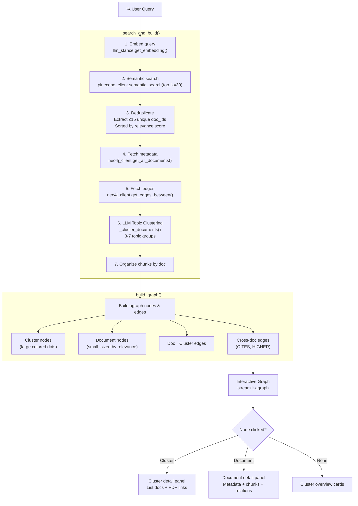

# Knowledge Map — Pipeline Documentation

> GraphRAG Visual Legal Document Explorer  
> Open Knowledge Maps-style semantic search + topic clustering + interactive graph  
> **Standalone visual exploration app**

---

## Architecture Overview

```
┌────────────────────┐
│  Streamlit UI       │
│  (app.py)           │
│                     │
│  • Hero search bar  │
│  • Interactive graph │
│  • Detail panel     │
│  • Cluster cards    │
└────────┬───────────┘
         │
         ▼
┌────────────────────┐     ┌──────────────┐     ┌──────────────┐
│  _search_and_build │────▶│  Pinecone    │     │  Neo4j Aura  │
│  (core pipeline)   │     │  VDB search  │     │  • metadata  │
│                    │     │  top_k=30    │     │  • CITES     │
│  1. Embed query    │     └──────────────┘     │  • HIGHER    │
│  2. Semantic search│                          └──────────────┘
│  3. Dedup docs     │     ┌──────────────┐
│  4. Fetch metadata │────▶│  OpenRouter   │
│  5. Fetch edges    │     │  (Claude)     │
│  6. LLM clustering │     │  • clustering │
│  7. Organize chunks│     └──────────────┘
└────────┬───────────┘
         │
         ▼
┌────────────────────┐     ┌──────────────┐
│  _build_graph      │────▶│  Streamlit   │
│  (visualization)   │     │  Agraph      │
│                    │     │  • physics   │
│  • Cluster nodes   │     │  • click     │
│  • Document nodes  │     │  • draggable │
│  • Relationship    │     └──────────────┘
│    edges           │
└────────────────────┘     ┌──────────────┐
                           │  AWS S3       │
                           │  • PDF URLs   │
                           └──────────────┘
```

**Services:**

| Service | Purpose | Env Var |
|---------|---------|---------|
| Pinecone | Vector DB — semantic search over legal chunks | `PINECONE_API_KEY`, `PINECONE_INDEX` |
| HuggingFace | Embedding endpoint — Indo-LegalBERT-V3 (1024-dim) | `HF_AUTH_TOKEN`, `HF_ENDPOINT_URL` |
| Neo4j Aura | Graph DB — document metadata + CITES/HIGHER edges | `NEO4J_URI`, `NEO4J_USER`, `NEO4J_PASSWORD` |
| OpenRouter | LLM — topic clustering (Claude Sonnet) | `OPENROUTER_API_KEY`, `LLM_MODEL` |
| AWS S3 | PDF storage — pre-signed URLs | `AWS_ACCESS_KEY_ID`, `AWS_SECRET_ACCESS_KEY` |

---

## Key Differentiators

| Feature | Knowledge Map | Search / Chatbot |
|---------|--------------|------------------|
| **Purpose** | Visual exploration & topic discovery | Q&A answering |
| **Pipeline** | Linear (search → cluster → visualize) | Agentic (route → retrieve → answer) |
| **LangGraph** | Not used | 5-6 node StateGraph |
| **LLM Usage** | Topic clustering only (1 call) | Routing, sufficiency, reranking, answering (4-6 calls) |
| **Output** | Interactive force-directed graph | Markdown legal analysis |
| **Conversation** | Single-query (no memory) | Multi-turn with history |
| **VDB top_k** | 30 | 20 (semantic) / 25 (deep) |
| **Max docs** | 15 unique | 5 primary |

---

## Pipeline Flow



---

## Core Functions

### `_search_and_build(query: str) → dict`

The main pipeline function. Executes search, clustering, and data organization.

**Algorithm:**

```
1. EMBED query
   embedding = llm_stance.get_embedding(query)

2. SEMANTIC SEARCH
   vdb_hits = pinecone_client.semantic_search(embedding, top_k=30)

3. DEDUPLICATE & SORT
   For each hit: extract unique doc_ids (first-seen gets highest score)
   Keep top 15 unique docs, sorted by relevance

4. FETCH NEO4J METADATA
   all_docs = neo4j_client.get_all_documents()
   Attach vdb_score to each doc metadata

5. FETCH RELATIONSHIP EDGES
   If ≥2 docs and Neo4j connected:
     edges = neo4j_client.get_edges_between(doc_ids)

6. LLM TOPIC CLUSTERING
   clusters = _cluster_documents(query, doc_metas)

7. ORGANIZE CHUNKS PER DOC
   chunks_by_doc = {doc_id: [hit1, hit2, ...]}

RETURN {
    query, doc_metas, doc_map, clusters,
    edges, chunks_by_doc, latency,
    total_docs, total_chunks
}
```

**Services called:**
- 1 HuggingFace embedding call
- 1 Pinecone search call
- 1 Neo4j `get_all_documents()` (cached 1hr)
- 1 Neo4j `get_edges_between()`
- 1 OpenRouter LLM call (clustering)

**Typical latency:** 2-5 seconds

---

### `_cluster_documents(query: str, doc_metas: list[dict]) → list[dict]`

Uses LLM to intelligently group documents into 3-7 topic clusters.

**LLM Call:**

| Parameter | Value |
|-----------|-------|
| Model | `LLM_MODEL` (Claude Sonnet) |
| Temperature | 0.2 |
| Max tokens | 1000 |
| System prompt | Indonesian legal expert, cluster into 3-7 topics |

**Input:** Query + list of documents with `doc_id`, `judul`, `doc_type`

**Output:** JSON array:
```json
[
  {
    "topic": "Perizinan Berusaha",
    "description": "Regulasi terkait proses perizinan usaha dan OSS",
    "doc_ids": ["UU-NASIONAL-11-2020", "PP-NASIONAL-5-2021"]
  }
]
```

**Rules enforced:**
- Each doc appears in exactly 1 cluster
- Topic: 2-5 words, Indonesian
- If <4 docs: use 1-2 clusters only

**Fallback:** On LLM error, returns single cluster "Hasil Pencarian" with all docs.

---

### `_build_graph(results: dict) → tuple[list[Node], list[Edge]]`

Converts search results into streamlit-agraph nodes and edges.

**Node Types:**

| Type | Shape | Size | Color | Label |
|------|-------|------|-------|-------|
| Cluster | Dot | 35 + n_docs × 5 | 10-color palette (blue, green, amber, ...) | Topic name |
| Document | Dot | 18 + score × 12 | White with colored border | Short label (e.g., "UU 40/2007") |

**Edge Types:**

| Type | Color | Style | Width |
|------|-------|-------|-------|
| Doc → Cluster | Cluster color | Solid | 1.5 |
| CITES | `#2563eb` (blue) | Solid | 1 |
| HIGHER | `#94a3b8` (gray) | Dashed | 1 |

**Agraph Config:**
- Physics: enabled (force-directed layout)
- Directed: true
- Node highlight: enabled
- Height: 620px
- Collapsible: false

---

## UI Layout

### Hero Section
- 🗺️ Knowledge Map title with gradient text
- Search input + "🔍 Cari" button
- 6 example queries in columns (e.g., "Perizinan berusaha dan OSS", "Ketenagakerjaan dan PHK")

### Results Display

**Stats Bar (4 columns):**
- Documents count
- Clusters count
- Chunks count
- Latency (seconds)

**Two-Column Layout:**

| Left (3/5) | Right (2/5) |
|------------|-------------|
| Interactive agraph | Detail panel |
| Click nodes to select | Updates on selection |
| Physics-based layout | Scrollable content |

### Detail Panel States

**Cluster selected:**
- 🗂️ Cluster topic name + description
- List of docs in cluster with "📄 Buka PDF" + "Lihat Detail" buttons

**Document selected:**
- 📋 Short label + doc type badge
- Relevance score metric
- 3-column metadata (Jenis, Tahun, Nomor)
- Full judul (title)
- "📄 Buka PDF" button (S3 pre-signed URL)
- Top 5 relevant chunks (expandable)
- Related documents section (edges: CITES/HIGHER)

**No selection:**
- 📊 Cluster overview cards
- Each card: topic name, doc count, doc labels, description
- "Lihat Cluster" button per card

---

## Session State

```python
{
    "km_results": None,           # _search_and_build() output dict
    "km_query": "",               # Current query string
    "km_selected_node": None,     # Currently selected graph node ID
}
```

---

## Helper Functions

| Function | Purpose |
|----------|---------|
| `_get_doc_short_label(doc_id)` | Format "UU-NASIONAL-40-2007" → "UU 40/2007" |
| `_get_doc_type_from_id(doc_id)` | Map prefix → full type name (e.g., "UU" → "Undang-Undang") |
| `_s3_presigned_url(doc_id)` | Generate S3 pre-signed URL (cached 300s, 1hr expiry) |

---

## Cost Summary

| Step | LLM Tokens | API Calls | Latency |
|------|-----------|-----------|---------|
| Embedding | — | 1 HuggingFace | 0.5-1s |
| Semantic Search | — | 1 Pinecone | 0.3-1s |
| Neo4j Metadata | — | 1 Neo4j (cached) | 0.1-0.5s |
| Neo4j Edges | — | 1 Neo4j | 0.3-1s |
| LLM Clustering | ~800-1000 | 1 OpenRouter | 1-3s |
| **Total** | **~800-1000** | **~5 calls** | **~2-6s** |

This is significantly cheaper than the Q&A apps since only 1 LLM call is made (clustering).
