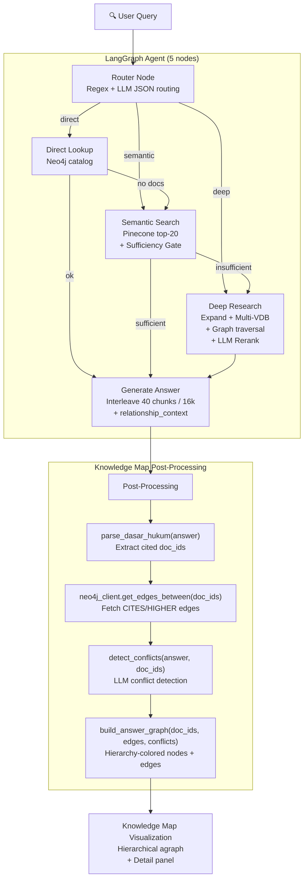

# Search + Knowledge Map — Pipeline Documentation

> GraphRAG Legal Document Relationship Explorer + Knowledge Map  
> 4-tab Streamlit application: Search & Discover, Browse Graph, Compare Documents, Kausalitas  
> **v3 — LangGraph Agentic Router + Knowledge Map Visualization + Conflict Detection**

---

## Architecture Overview

```
┌──────────────────────────────────────────────────────────────────────┐
│  Streamlit UI (search_km/app.py) — 4 Tabs                          │
│                                                                      │
│  ┌──────────────┐ ┌────────────┐ ┌──────────────┐ ┌──────────────┐ │
│  │ Search &     │ │ Browse     │ │ Compare      │ │ Kausalitas   │ │
│  │ Discover     │ │ Graph      │ │ Documents    │ │              │ │
│  │              │ │            │ │              │ │              │ │
│  │ Q&A + KM     │ │ Full Neo4j │ │ Benchmark    │ │ NLI Results  │ │
│  │ Graph        │ │ hierarchy  │ │ CSV viewer   │ │ Dashboard    │ │
│  └──────┬───────┘ └─────┬──────┘ └──────┬───────┘ └──────┬───────┘ │
└─────────┼───────────────┼───────────────┼────────────────┼──────────┘
          │               │               │                │
          ▼               ▼               │                │
┌─────────────────┐ ┌──────────┐    ┌─────┴──────┐  ┌─────┴──────┐
│ LangGraph Agent │ │ Neo4j    │    │ CSV files  │  │ CSV files  │
│ (5 nodes)       │ │ Overview │    │ output/    │  │ output/    │
│                 │ │ query    │    │ retrieval/ │  │ kausalitas/│
│ + Knowledge Map │ │          │    └────────────┘  └────────────┘
│   post-process  │ │          │
└────────┬────────┘ └──────────┘
         │
    ┌────┴────┬──────────┬───────────┬──────────┐
    │         │          │           │          │
    ▼         ▼          ▼           ▼          ▼
┌────────┐ ┌────────┐ ┌──────────┐ ┌────────┐ ┌────────┐
│OpenRout│ │Pinecone│ │ Neo4j    │ │ HF     │ │ AWS S3 │
│(Claude)│ │ VDB    │ │ Aura     │ │ Embed  │ │ PDFs   │
│• route │ │• search│ │ • docs   │ │ 1024d  │ │• URLs  │
│• suff  │ │• top20 │ │ • CITES  │ │        │ │        │
│• rerank│ │        │ │ • HIGHER │ │        │ │        │
│• answer│ │        │ │ • Pasal  │ │        │ │        │
│• confli│ │        │ │ • browse │ │        │ │        │
└────────┘ └────────┘ └──────────┘ └────────┘ └────────┘
```

**Services:**

| Service | Purpose | Env Var |
|---------|---------|---------|
| Neo4j Aura | Graph DB — documents, citations, hierarchy, overview | `NEO4J_URI`, `NEO4J_USER`, `NEO4J_PASSWORD` |
| Pinecone | Vector DB — semantic search over legal chunks | `PINECONE_API_KEY`, `PINECONE_INDEX` |
| HuggingFace | Embedding — Indo-LegalBERT-V3 (1024-dim) | `HF_AUTH_TOKEN`, `HF_ENDPOINT_URL` |
| OpenRouter | LLM — routing, sufficiency, reranking, answering, conflict detection | `OPENROUTER_API_KEY`, `LLM_MODEL` |
| OpenRouter (Router) | Optional separate model for routing decisions | `LLM_ROUTER_MODEL` (fallback: `LLM_MODEL`) |
| AWS S3 | Document PDF storage — pre-signed URLs | `AWS_ACCESS_KEY_ID`, `AWS_SECRET_ACCESS_KEY`, `AWS_REGION` |

---

## Key Differentiators

| Feature | search_km | search | chatbot | knowledge_map |
|---------|-----------|--------|---------|---------------|
| **Tabs** | 4 (Search+KM, Browse, Compare, Kausalitas) | 4 (same, no KM) | Chat only | KM only |
| **Knowledge Map** | Yes (post-answer graph) | No | No | Yes (standalone) |
| **Conflict Detection** | Yes (LLM-detected contradictions) | No | No | No |
| **LangGraph** | 5 nodes (no summarize) | 5 nodes | 6 nodes | None |
| **Retrieval** | Dense-only Pinecone | Dense-only | Hybrid BM25+Dense | Dense-only |
| **Conversation Memory** | None | None | Full (SQLite) | None |
| **Answer Generation** | Single-turn (no history) | Single-turn | Multi-turn with memory | No answer |
| **Benchmark Tab** | Yes (retrieval CSV) | Yes | No | No |
| **Kausalitas Tab** | Yes (NLI dashboard) | Yes | No | No |

---

## Tab 1: Search & Discover + Knowledge Map

This tab combines the LangGraph agentic Q&A pipeline with a post-answer knowledge map visualization.

### Pipeline Flow



### LangGraph State

```python
class GraphState(TypedDict):
    query: str                          # User question
    route: str                          # "direct" | "semantic" | "deep"
    primary_doc_ids: List[str]          # Final document IDs
    context_docs: Dict[str, dict]       # {doc_id: {source, chunks[]}}
    relationship_context: str           # CITES/HIGHER edge text
    answer: str                         # Final generated answer
    logs: List[str]                     # System debug logs
    narratives: List[str]               # User-facing legal explanations
```

**No conversation memory fields** — this app is single-turn (no `chat_history`, `summary`, or `user_context`).

### LangGraph Nodes

5 nodes (no `summarize_if_needed`):

```python
workflow = StateGraph(GraphState)
workflow.add_node("router", router_node)
workflow.add_node("direct_lookup", direct_lookup_node)
workflow.add_node("semantic_search", semantic_search_node)
workflow.add_node("deep_research", deep_research_node)
workflow.add_node("generate_answer", generate_answer_node)

workflow.set_entry_point("router")  # No summarize step
```

Routing and escalation logic is identical to the search app: `direct` → `semantic` → `deep` (escalation only, never downgrade).

### Node Details

#### Router Node
- Regex extraction for explicit doc references (10 patterns)
- LLM JSON routing: `{thought_process, route}`
- Narrative streamed live to UI

#### Direct Lookup Node
- Neo4j catalog lookup via `smart_doc_lookup()` (≤3 docs)
- Fallback to semantic if no docs found

#### Semantic Search Node
- **Dense-only** search: `pinecone_client.semantic_search(top_k=20)`
- No BM25 hybrid (unlike chatbot)
- LLM sufficiency gate: `{thought_process, is_sufficient}`
- Escalates to deep if insufficient

#### Deep Research Node
1. `expand_query()` → 2-3 alternative terms
2. Multi-term VDB search (query + 2 expanded × top-25)
3. Neo4j catalog lookup via `smart_doc_lookup()`
4. 2-hop graph traversal via `get_citing_documents(hops=2)` × 3
5. LLM reranking: score ≥ 3.0, top 5 docs

#### Generate Answer Node
- Round-robin interleave: 40 chunks / 16k chars
- `ask_about_documents(query, chunks, relationship_context)` — **no conversation context**

---

### Knowledge Map Post-Processing

After the LangGraph agent returns an answer, the search_km app performs additional analysis:

#### 1. Parse DASAR_HUKUM — `parse_dasar_hukum(answer)`

Extracts cited document IDs from the answer footer:
```
DASAR_HUKUM: ['UU-NASIONAL-11-2020', 'PP-NASIONAL-5-2021']
```
→ `["UU-NASIONAL-11-2020", "PP-NASIONAL-5-2021"]`

#### 2. Fetch Neo4j Edges

```python
edges_data = neo4j_client.get_edges_between(doc_ids)
# Returns: {nodes: [...], edges: [{source_id, target_id, type}]}
```

#### 3. Detect Conflicts — `detect_conflicts(answer, doc_ids)`

**LLM Call:**

| Parameter | Value |
|-----------|-------|
| Model | `LLM_ROUTER_MODEL` |
| Temperature | 0.1 |
| Max tokens | 400 |

Asks the LLM to identify conflicting regulation pairs from the answer text. Returns:
```json
[{"source": "UU-NASIONAL-11-2020", "target": "PP-NASIONAL-5-2021", "label": "ketentuan PHK bertentangan"}]
```

Only returns validated conflicts where both source and target are in the doc_ids list.

#### 4. Build Answer Graph — `build_answer_graph(doc_ids, edges, conflicts)`

Creates streamlit-agraph nodes and edges with:

**Nodes** — hierarchy-colored boxes:

| Hierarchy Level | Regulation Type | Color |
|----------------|----------------|-------|
| 1 | UUD 1945 | `#0f172a` (dark navy) |
| 2 | Ketetapan MPR | `#1e3a5f` |
| 3 | UU / Perppu | `#1d4ed8` (blue) |
| 4 | PP | `#2563eb` (blueprint blue) |
| 5 | Perpres | `#0891b2` (teal) |
| 6 | Keppres | `#0d9488` |
| 7 | Inpres | `#059669` |
| 8 | Permen (all variants) | `#7c3aed` (purple) |
| 9 | Perda | `#c026d3` (magenta) |
| 10 | Pergub/Perbup/Perwal | `#e11d48` (red) |
| 11 | SK/SK_DIRJEN | `#6b7280` (gray) |

**Edges:**

| Type | Color | Style | Width |
|------|-------|-------|-------|
| CITES | `#2563eb` (blue) | Solid | 1.5 |
| HIGHER | `#94a3b8` (gray) | Dashed | 1.5 |
| KONFLIK | `#dc2626` (red) | Solid + bold label | 4 |

---

### Knowledge Map UI

```
┌─────────────────────────────────────────────────────────────┐
│  Stat Bar: [Dokumen: N] [Sitasi: N] [Hierarki: N] [Konflik]│
├─────────────────────────────────────────────────────────────┤
│  Color Legend: ● UU (blue) ● PP (blueprint) ● Permen (purple)│
│  Edge Legend:  ── CITES    - - HIGHER    ━━ KONFLIK         │
├──────────────────────────────┬──────────────────────────────┤
│                              │                              │
│   Hierarchical agraph        │   Detail Panel               │
│   (physics=false)            │                              │
│                              │   📋 Doc metadata            │
│   Nodes stacked by           │   📄 Buka PDF (S3 URL)       │
│   legal hierarchy            │   Kutipan Relevan (chunks)   │
│                              │   Relasi Hukum (edges)       │
│   Y-axis: hierarchy level    │                              │
│   X-axis: doc_id hash        │                              │
│                              │                              │
│   Click node to select →     │   ← Updates on selection     │
│                              │                              │
└──────────────────────────────┴──────────────────────────────┘
```

**Agraph Config:**
- Physics: **disabled** (hierarchical layout)
- Hierarchical: `{direction: "UD", sortMethod: "directed"}`
- Height: 550px
- Node spacing: 180, level separation: 120

---

## Tab 2: Browse Graph

Full interactive exploration of the Neo4j document hierarchy.

**Data Source:** `neo4j_client.get_graph_overview()` → all Document nodes + all CITES/HIGHER edges.

**Visualization:** Same `graph_viz.render_document_graph()` as the search app — hierarchical layout with legal hierarchy on Y-axis, year on X-axis.

**Interaction:** Click any node → detail panel shows document metadata, Pasal list, and relationships.

---

## Tab 3: Compare Documents

Read-only benchmark results viewer.

**Data Sources:**
- Recap CSVs from `output/retrieval/recap/` — aggregated metrics per pipeline config
- Detail CSVs from `output/retrieval/detail/csv/` — per-question metrics

**Pipeline Configs Compared:**
- `VDB` — Pure Pinecone dense search
- `GraphRAG_ReRank` — Graph-augmented with LLM reranking
- `GraphRAG+GPT_ReRank` — Graph-augmented with GPT reranking
- `VDB+GraphRAG` — VDB + graph fusion

**Datasets:**
- QA 100 — Full 100-question benchmark
- QA Business — Business-domain subset

**UI:** Dropdown selects config + dataset → displays recall, precision, MRR, and per-question detail table.

---

## Tab 4: Kausalitas

Natural Language Inference (NLI) analysis dashboard for legal relationship classification.

**Data Sources:**
- `output/kausalitas/kausalitas_results.csv` — Per-pair NLI results
- `output/kausalitas/kausalitas_summary.csv` — Aggregate summary

**NLI Labels:**
- **Entailment** — One regulation supports/follows from another
- **Contradiction** — Regulations conflict
- **Neutral** — No clear logical relationship

**UI Components:**
1. **KPI Cards** — Total pairs, entailment count, contradiction count, neutral count
2. **Distribution Chart** — Altair bar chart showing label distribution
3. **Filter & Search Table** — Filter by label, search by doc_id or text
4. **Detail Cards** — Expandable rows with Pasal highlighting via `<mark>` tags

---

## Session State

```python
{
    "stance_cache": {},           # {src→tgt: {stance, reason, confidence}}
    "search_results": None,       # Raw VDB results
    "search_doc_ids": [],         # Primary document IDs
    "selected_node": None,        # Browse tab: selected node
    "search_answer": None,        # Final LLM answer
    "search_context_docs": {},    # {doc_id: {source, chunks[]}}
    "search_edges": [],           # Edge data
    "km_neo4j_edges": [],         # Knowledge map edges
    "km_conflicts": [],           # Conflict pairs
    "km_doc_ids": [],             # Knowledge map doc IDs
    "km_selected_node": None,     # KM: selected node
}
```

---

## Module Reference

### `utils/langgraph_agent.py`

| Function | Signature | Purpose |
|----------|-----------|---------|
| `router_node(state)` | `(GraphState) → GraphState` | Regex + LLM JSON routing |
| `direct_lookup_node(state)` | `(GraphState) → GraphState` | Neo4j catalog lookup |
| `semantic_search_node(state)` | `(GraphState) → GraphState` | Dean-only VDB search + sufficiency |
| `deep_research_node(state)` | `(GraphState) → GraphState` | Expand + multi-VDB + graph + rerank |
| `generate_answer_node(state)` | `(GraphState) → GraphState` | Interleave + LLM answer (single-turn) |
| `_assemble_context_for_state(state, raw_vdb_hits)` | `(GraphState, list?) → GraphState` | VDB + Neo4j Pasal + edges |
| `_build_interleaved_context(...)` | `(...) → list[dict]` | Round-robin, 40 chunks / 16k chars |
| `create_agent()` | `() → CompiledGraph` | Build & compile (no checkpointer) |

### `utils/knowledge_graph.py`

| Function | Signature | Purpose |
|----------|-----------|---------|
| `parse_dasar_hukum(answer)` | `(str) → list[str]` | Extract doc_ids from DASAR_HUKUM footer |
| `detect_conflicts(answer, doc_ids)` | `(str, list) → list[dict]` | LLM conflict detection between regulations |
| `build_answer_graph(doc_ids, edges, conflicts)` | `(...) → tuple[list[Node], list[Edge]]` | Build hierarchy-colored agraph |
| `get_level_legend(doc_ids)` | `(list[str]) → list[dict]` | Legend entries for present hierarchy levels |
| `get_node_color(doc_id)` | `(str) → str` | Hierarchy color for a doc_id |

### `utils/graph_viz.py`

Same as `search/utils/graph_viz.py`:

| Function | Purpose |
|----------|---------|
| `render_document_graph(nodes, edges, stance_map, height)` | Hierarchical document relationship graph |
| `build_agraph_nodes(nodes)` | Convert Neo4j nodes to agraph Nodes |
| `build_agraph_edges(edges, stance_map)` | Convert edges with CITES/HIGHER coloring |

### `utils/benchmark_helpers.py`

| Function | Purpose |
|----------|---------|
| `extract_doc_ids_from_question(question)` | Regex-parse doc references (10 patterns) |
| `get_unique_doc_ids(results, max_docs)` | Deduplicate VDB results |
| `extract_documents(evidence_text)` | Parse doc refs from text with alias matching |

---

## Cost Summary

### Direct Route

| Step | LLM Tokens | API Calls | Latency |
|------|-----------|-----------|---------|
| Router (regex) | 0 | 0 | <1ms |
| Direct Lookup | ~400 | 1 OpenRouter + 1 Neo4j | 1-5s |
| Context Assembly | — | N Neo4j | 1-3s |
| Generate Answer | ~1500-2000 | 1 OpenRouter | 5-15s |
| KM: Conflict Detection | ~400 | 1 OpenRouter + 1 Neo4j | 1-3s |
| **Total** | **~2300-2800** | **~8-20 calls** | **~8-26s** |

### Semantic Route (sufficient)

| Step | LLM Tokens | API Calls | Latency |
|------|-----------|-----------|---------|
| Router | ~250 | 1 OpenRouter | 1-3s |
| Semantic Search | — | 1 HF + 1 Pinecone | 1-3s |
| Sufficiency | ~250 | 1 OpenRouter | 1-3s |
| Context Assembly | — | N Neo4j | 1-3s |
| Generate Answer | ~1500-2000 | 1 OpenRouter | 5-15s |
| KM: Conflict Detection | ~400 | 1 OpenRouter + 1 Neo4j | 1-3s |
| **Total** | **~2400-2900** | **~10-22 calls** | **~10-30s** |

### Deep Route

| Step | LLM Tokens | API Calls | Latency |
|------|-----------|-----------|---------|
| Router | ~250 | 1 OpenRouter | 1-3s |
| Deep Research | ~950 | 3 HF + 3 Pinecone + 1 Neo4j + 2 OpenRouter + 3 Neo4j | 5-15s |
| Context Assembly | — | N Neo4j | 1-3s |
| Generate Answer | ~1500-2000 | 1 OpenRouter | 5-15s |
| KM: Conflict Detection | ~400 | 1 OpenRouter + 1 Neo4j | 1-3s |
| **Total** | **~3100-3600** | **~20-35 calls** | **~13-39s** |

Note: Conflict detection adds ~400 tokens and 1-3s on top of the base search pipeline cost.
