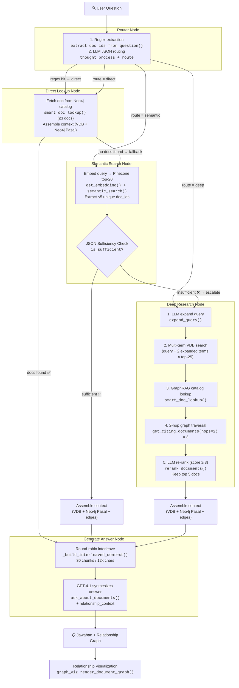

# Search & Discover — Pipeline Documentation

> GraphRAG Legal Document Relationship Explorer  
> Tab 1: "Search & Discover" (Tanya Jawab Regulasi)  
> **v2 — LangGraph Agentic Router Architecture**

---

## Architecture Overview

```
┌─────────────┐    ┌───────────────────────────────────────────┐
│  Streamlit   │───▶│         LangGraph StateGraph              │
│  (app.py)    │◀───│  ┌────────┐  ┌──────────┐  ┌──────────┐ │
│              │    │  │ Router  │─▶│ Direct / │─▶│ Generate │ │
│  • stream()  │    │  │  Node   │  │ Semantic/│  │  Answer  │ │
│  • narratives│    │  │         │  │  Deep    │  │   Node   │ │
│              │    │  └────────┘  └──────────┘  └──────────┘ │
└─────────────┘    └───────────────────────────────────────────┘
                          │              │              │
                    ┌─────┴──────┐ ┌─────┴──────┐ ┌────┴─────┐
                    │ OpenRouter  │ │  Pinecone  │ │  Neo4j   │
                    │ (GPT-4.1)  │ │  (VDB)     │ │  Aura    │
                    │ • route    │ │ • semantic │ │ • docs   │
                    │ • suffice  │ │   search   │ │ • CITES  │
                    │ • rerank   │ │ • fetch    │ │ • HIGHER │
                    │ • answer   │ │ • 1024-dim │ │ • Pasal  │
                    └────────────┘ └────────────┘ └──────────┘
                                         ▲
                                         │
                                   ┌──────────────┐
                                   │ HuggingFace  │
                                   │ Indo-Legal   │
                                   │ BERT-V3      │
                                   │ (embedding)  │
                                   └──────────────┘
```

**Services:**

| Service | Purpose | Env Var |
|---------|---------|---------|
| Neo4j Aura | Graph DB — documents, citations, hierarchy | `NEO4J_URI`, `NEO4J_USER`, `NEO4J_PASSWORD` |
| Pinecone | Vector DB — semantic search over legal chunks | `PINECONE_API_KEY`, `PINECONE_INDEX` |
| HuggingFace | Embedding endpoint — Indo-LegalBERT-V3 (1024-dim) | `HF_AUTH_TOKEN`, `HF_ENDPOINT_URL` |
| OpenRouter | LLM gateway — GPT-4.1 for reasoning & routing | `OPENROUTER_API_KEY`, `LLM_MODEL` |
| OpenRouter (Router) | Optional separate model for routing decisions | `LLM_ROUTER_MODEL` (fallback: `LLM_MODEL`) |

---

## Pipeline Flow (LangGraph Agentic Router)

The pipeline is implemented as a **LangGraph `StateGraph`** with conditional edges. Instead of a linear Phase A→B→C…→H pipeline with gate-based early exits, an LLM **Router Node** classifies each query into one of three routes (`direct`, `semantic`, `deep`) and dispatches to the appropriate processing node. Each node can escalate to a heavier route if its results are insufficient.



### LangGraph State

All nodes share and mutate a single `GraphState` TypedDict:

```python
class GraphState(TypedDict):
    query: str                          # User question
    route: str                          # "direct" | "semantic" | "deep"
    primary_doc_ids: List[str]          # Final document IDs for answer
    context_docs: Dict[str, dict]       # {doc_id: {source, chunks[]}}
    relationship_context: str           # CITES/HIGHER edge text
    answer: str                         # Final generated answer
    logs: List[str]                     # System debug logs
    narratives: List[str]               # User-facing legal explanations (Indonesian)
```

### Graph Edges (Routing Logic)

```python
workflow = StateGraph(GraphState)

# Nodes
workflow.add_node("router", router_node)
workflow.add_node("direct_lookup", direct_lookup_node)
workflow.add_node("semantic_search", semantic_search_node)
workflow.add_node("deep_research", deep_research_node)
workflow.add_node("generate_answer", generate_answer_node)

# Entry
workflow.set_entry_point("router")

# Router → one of three nodes
workflow.add_conditional_edges("router", router_condition)
#   "direct"   → direct_lookup
#   "semantic"  → semantic_search
#   "deep"      → deep_research

# Direct → answer OR fallback to semantic
workflow.add_conditional_edges("direct_lookup", route_after_direct)

# Semantic → answer OR escalate to deep
workflow.add_conditional_edges("semantic_search", route_after_semantic)

# Deep always → answer
workflow.add_edge("deep_research", "generate_answer")
workflow.add_edge("generate_answer", END)
```

---

## Node-by-Node Detail

### Router Node — `router_node()`

| Step | Function | Module | Service | Cost |
|------|----------|--------|---------|------|
| 1. Regex extraction | `extract_doc_ids_from_question(query)` | `benchmark_helpers` | Local | Free |
| 2. LLM route decision | `client.chat.completions.create()` | `llm_stance` | OpenRouter | ~250 tokens |

**Step 1:** Parses explicit references like "PP 34/2021" → `PP-NASIONAL-34-2021` using 10 regex patterns. If a regex hit is found, the route is immediately set to `"direct"` without calling the LLM.

**Step 2:** If no regex hit, the LLM receives the query and returns a **JSON object** with two keys:

```json
{
  "thought_process": "Saya sedang menganalisis apakah pertanyaan ini ...",
  "route": "direct | semantic | deep"
}
```

**Route classification:**

| Route | When | Example Queries |
|-------|------|-----------------|
| `direct` | Asking about a specific pasal/UU by name | "Apa isi Pasal 5 UU 40/2007?" |
| `semantic` | General concept or standard rule lookup | "Apa syarat pembagian dividen interim?" |
| `deep` | Complex analysis: conflicts, harmony, exceptions, legal history between multiple laws | "Apakah UU Cipta Kerja mengubah ketentuan PHK di UU Ketenagakerjaan?" |

**Narrative:** The `thought_process` field is streamed live to the user as a lawyer-like explanation (in Indonesian). No technical terms like "vector DB" are exposed.

**Fallback:** On any error, defaults to `"semantic"`.

### Direct Lookup Node — `direct_lookup_node()`

| Function | Module | Service | Cost |
|----------|--------|---------|------|
| `get_all_documents()` | `neo4j_client` | Neo4j Aura | 1 Cypher query (cached 1hr) |
| `smart_doc_lookup(query, all_docs)` | `llm_stance` | OpenRouter GPT-4.1 | ~400 tokens |
| `_assemble_context_for_state()` | `langgraph_agent` | Neo4j + Pinecone | N queries |

1. If `primary_doc_ids` is empty (no regex hits), uses `smart_doc_lookup()` to pick ≤3 docs from the Neo4j catalog.
2. If still no docs found, **falls back to `semantic`** route.
3. Otherwise, assembles context (VDB chunks + Neo4j Pasal/Ayat + graph edges) and proceeds to answer.

**Narrative:** "Saya telah menemukan dokumen yang tepat, dan sedang membaca ketentuannya..."

### Semantic Search Node — `semantic_search_node()`

| Step | Function | Module | Service | Cost |
|------|----------|--------|---------|------|
| 1. VDB search | `get_embedding()` + `semantic_search(top_k=20)` | `llm_stance` / `pinecone_client` | HF + Pinecone | 2 API calls |
| 2. Sufficiency check | `client.chat.completions.create()` | `llm_stance` | OpenRouter | ~250 tokens |
| 3. Context assembly | `_assemble_context_for_state()` | `langgraph_agent` | Neo4j + Pinecone | N queries |

**Step 1:** Embeds the query and searches Pinecone for top-20 results. Extracts ≤5 unique doc_ids.

**Step 2 — JSON Sufficiency Check:** The LLM receives retrieved excerpts and returns:

```json
{
  "thought_process": "Konteks awal telah ditemukan, namun saya merasa perlu memverifikasi ...",
  "is_sufficient": true | false
}
```

The `thought_process` is streamed as a narrative. If `is_sufficient` is `false`, the route is escalated to `"deep"`.

**Step 3:** If sufficient, assembles full context and proceeds to answer generation.

**Fallback:** On VDB error or sufficiency check error, **escalates to `deep`** (conservative).

### Deep Research Node — `deep_research_node()`

| Step | Function | Module | Service | Cost |
|------|----------|--------|---------|------|
| 1. Query expansion | `expand_query(query)` | `llm_stance` | OpenRouter | ~250 tokens |
| 2. Multi-term VDB | `get_embedding()` × 3 + `semantic_search(top_k=25)` × 3 | `llm_stance` / `pinecone_client` | HF + Pinecone | 6 API calls |
| 3. Graph catalog | `get_all_documents()` + `smart_doc_lookup()` | `neo4j_client` / `llm_stance` | Neo4j + OpenRouter | ~400 tokens |
| 4. 2-hop traversal | `get_citing_documents(hops=2)` × 3 | `neo4j_client` | Neo4j | 3 Cypher queries |
| 5. Re-ranking | `rerank_documents(query, doc_summaries)` | `llm_stance` | OpenRouter | ~300 tokens |
| 6. Context assembly | `_assemble_context_for_state()` | `langgraph_agent` | Neo4j + Pinecone | N queries |

**Step 1:** Generates 3-5 synonym phrases (e.g., "dividen interim" → "pembagian laba sementara").

**Step 2:** Searches VDB with original query + 2 expanded terms (25 results each). Deduplicates across all results. Extracts ≤10 unique doc_ids.

**Step 3:** LLM scans the full Neo4j document catalog and picks relevant docs. Merges with VDB doc_ids.

**Step 4:** For the top-3 merged docs, performs 2-hop graph traversal via `CITES` and `HIGHER` relationships. Discovers regulations the user didn't mention and VDB didn't surface.

**Step 5:** LLM scores all candidates 0-10. Keeps docs with score ≥ 3, max 5. Falls back to top-5 merged if none pass.

**Step 6:** Assembles full context.

**Narrative:** "Sistem melakukan penelusuran hukum secara ekstensif (historis dan relasi regulasi) untuk memastikan keakuratan..."

### Context Assembly — `_assemble_context_for_state()`

Shared helper called by all processing nodes. For each doc in `primary_doc_ids`:

| Source | Data | Dedup |
|--------|------|-------|
| VDB semantic hits | Raw hits passed via `raw_vdb_hits` param | By chunk `id` via `seen_chunk_ids` |
| Neo4j Pasal/Ayat | `get_document_detail(did)` → pasals + ayats | By `neo-{did}-{pid}` synthetic ID |
| Graph edges | `get_edges_between(doc_ids)` → CITES/HIGHER | Appended to `relationship_context` |

Neo4j Pasal/Ayat content is **always** fetched for all primary documents. A `seen_chunk_ids` set deduplicates Neo4j chunks against VDB chunks already present.

### Generate Answer Node — `generate_answer_node()`

| Step | Function | Module | Service | Cost |
|------|----------|--------|---------|------|
| 1. Interleave context | `_build_interleaved_context()` | `langgraph_agent` | Local | Free |
| 2. Generate answer | `ask_about_documents(query, chunks, relationship_context)` | `llm_stance` | OpenRouter GPT-4.1 | ~1500-2000 tokens |

**Step 1 — Round-Robin Interleave:**
1. Group all chunks by `doc_id`
2. Per doc: sort by semantic score (scored first, then unscored)
3. Round-robin: take 1 chunk from each doc in turn
4. Stop at **30 chunks** or **12,000 characters**

**Step 2 — Answer Generation:** GPT-4.1 synthesizes the answer from interleaved context + relationship graph. The system prompt includes:
- **Anti-"Tidak" bias guard:** Prevents the LLM from defaulting to "No" on regulatory relationship questions
- **Relationship awareness:** Uses CITES/HIGHER edges to infer connections between regulations
- **Exception/limitation checking:** Checks for exception clauses
- Start with firm conclusion, cite specific Pasal & Ayat

### Relationship Visualization (UI only)

| Function | Module | Service |
|----------|--------|---------|
| `render_document_graph(nodes, edges)` | `graph_viz` | Local |

After the answer is displayed, an interactive graph visualization shows the **subgraph** of documents used in the answer and their CITES/HIGHER relationships.

---

## Streamlit Integration (app.py)

The LangGraph agent is executed via `agent.stream()`, which yields state updates per node:

```python
from utils.langgraph_agent import create_agent

agent = create_agent()
for event in agent.stream({"query": query, "logs": [], "narratives": [], "primary_doc_ids": []}):
    for node_name, state_update in event.items():
        final_state.update(state_update)
        # Stream new narratives live to user
        for nar in state_update.get("narratives", [])[seen_narratives:]:
            st.markdown(f"💭 *{nar}*")
```

**Narrative UI:** Each node appends Indonesian-language "thoughts" to `state["narratives"]`. These are rendered live in the Streamlit UI as the pipeline progresses, giving the user insight into the legal reasoning without exposing technical details.

**Debug Logs:** Raw system logs are available in an expandable `⚙️ System Debug Logs` section.

---

## Cost Summary

### Direct Route (regex hit or simple lookup)

| Node | LLM Tokens | API Calls | Latency |
|------|-----------|-----------|---------|
| Router (regex hit) | 0 | 0 | <1ms |
| Direct Lookup | ~400 | 1 OpenRouter + 1 Neo4j | 1-5s |
| Context Assembly | — | N Neo4j + N Pinecone | 1-3s |
| Generate Answer | ~1500-2000 | 1 OpenRouter | 5-15s |
| **Total** | **~1900-2400** | **~5-15 calls** | **~7-23s** |

### Semantic Route (sufficient at first check)

| Node | LLM Tokens | API Calls | Latency |
|------|-----------|-----------|---------|
| Router | ~250 | 1 OpenRouter | 1-3s |
| Semantic Search | — | 1 HF + 1 Pinecone | 1-3s |
| Sufficiency Check | ~250 | 1 OpenRouter | 1-3s |
| Context Assembly | — | N Neo4j | 1-3s |
| Generate Answer | ~1500-2000 | 1 OpenRouter | 5-15s |
| **Total** | **~2000-2500** | **~8-20 calls** | **~9-27s** |

### Semantic → Deep Escalation

| Node | LLM Tokens | API Calls | Latency |
|------|-----------|-----------|---------|
| Router | ~250 | 1 OpenRouter | 1-3s |
| Semantic (insufficient) | ~250 | 1 HF + 1 Pinecone + 1 OpenRouter | 2-6s |
| Deep Research | ~950 | 3 HF + 3 Pinecone + 1 OpenRouter + 3 Neo4j + 1 OpenRouter | 5-15s |
| Context Assembly | — | N Neo4j | 1-3s |
| Generate Answer | ~1500-2000 | 1 OpenRouter | 5-15s |
| **Total** | **~2950-3450** | **~20-35 calls** | **~14-42s** |

### Deep Route (directly routed)

| Node | LLM Tokens | API Calls | Latency |
|------|-----------|-----------|---------|
| Router | ~250 | 1 OpenRouter | 1-3s |
| Deep Research | ~950 | 3 HF + 3 Pinecone + 1 Neo4j + 1 OpenRouter + 3 Neo4j + 1 OpenRouter | 5-15s |
| Context Assembly | — | N Neo4j | 1-3s |
| Generate Answer | ~1500-2000 | 1 OpenRouter | 5-15s |
| **Total** | **~2700-3200** | **~18-30 calls** | **~12-36s** |

---

## Module Reference

### `utils/langgraph_agent.py`

| Function | Signature | Purpose |
|----------|-----------|---------|
| `router_node(state)` | `(GraphState) → GraphState` | Regex + LLM JSON routing → sets `route` |
| `direct_lookup_node(state)` | `(GraphState) → GraphState` | Neo4j catalog lookup, fallback to semantic |
| `semantic_search_node(state)` | `(GraphState) → GraphState` | VDB top-20 + JSON sufficiency check, escalate to deep |
| `deep_research_node(state)` | `(GraphState) → GraphState` | Expand + multi-VDB + graph traversal + rerank |
| `generate_answer_node(state)` | `(GraphState) → GraphState` | Interleave + GPT-4.1 answer |
| `_assemble_context_for_state(state, raw_vdb_hits)` | `(GraphState, list?) → GraphState` | Shared: VDB + Neo4j Pasal + edges assembly |
| `_build_interleaved_context(primary, related, context_docs, max_chunks, max_chars)` | `(list, list, dict, int, int) → list[dict]` | Round-robin interleave, 30 chunks / 12k chars |
| `create_agent()` | `() → CompiledGraph` | Build & compile the LangGraph workflow |

### `utils/llm_stance.py`

| Function | Signature | Purpose |
|----------|-----------|---------|
| `get_embedding(text)` | `(str) → list[float]` | 1024-dim embedding via Indo-LegalBERT-V3 |
| `get_llm_client()` | `() → OpenAI` | Returns OpenRouter client instance |
| `expand_query(query)` | `(str) → list[str]` | 3-5 synonym search phrases |
| `smart_doc_lookup(query, all_docs)` | `(str, list[dict]) → list[str]` | LLM picks ≤10 doc_ids from Neo4j catalog |
| `rerank_documents(query, doc_summaries)` | `(str, dict[str,str]) → list[tuple[str,float]]` | LLM scores docs 0-10, sorted descending |
| `ask_about_documents(query, context_chunks, relationship_context)` | `(str, list[dict], str) → str` | RAG answer generation with Pasal citations + graph context |

### `utils/pinecone_client.py`

| Function | Signature | Purpose |
|----------|-----------|---------|
| `semantic_search(query_embedding, top_k, scope_filter)` | `(list[float], int, str?) → list[dict]` | Cosine search in Pinecone index |
| `fetch_by_doc_id(doc_id, top_k)` | `(str, int) → list[dict]` | Fetch all chunks for a specific doc_id |

### `utils/neo4j_client.py`

| Function | Signature | Purpose |
|----------|-----------|---------|
| `test_connection()` | `() → bool` | Check if Neo4j is reachable |
| `get_all_documents()` | `() → list[dict]` | All Document nodes (cached 1hr) |
| `get_document_detail(doc_id)` | `(str) → dict` | Doc + Pasal + Ayat + Diktum |
| `get_related_documents(doc_id, limit)` | `(str, int) → list[dict]` | 1-hop CITES/HIGHER neighbors |
| `get_citing_documents(doc_id, hops)` | `(str, int) → dict` | K-hop expansion via CITES/HIGHER |
| `get_edges_between(doc_ids)` | `(list[str]) → dict` | CITES/HIGHER edges between given docs |

### `utils/benchmark_helpers.py`

| Function | Signature | Purpose |
|----------|-----------|---------|
| `extract_doc_ids_from_question(question)` | `(str) → set[str]` | Regex-parse doc references from query text |
| `get_unique_doc_ids(results, max_docs)` | `(list[dict], int) → list[str]` | Unique doc_ids from VDB results |

---

## Routing & Escalation Logic

```python
# Router Node
regex_ids = extract_doc_ids_from_question(query)
if regex_ids:
    route = "direct"  # Immediate — skip LLM routing
else:
    route = LLM_JSON_response["route"]  # "direct" | "semantic" | "deep"

# Direct Node — fallback
if no_docs_found:
    route = "semantic"  # Escalate

# Semantic Node — sufficiency gate
if not LLM_JSON_response["is_sufficient"]:
    route = "deep"  # Escalate

# Deep Node — always proceeds to answer
# (no further escalation possible)
```

**Key design principles:**
- **Escalation only, never downgrade:** `direct` → `semantic` → `deep` (never backwards)
- **Conservative defaults:** Any LLM/API error triggers escalation (not a silent pass)
- **JSON Chain-of-Thought:** Router and sufficiency checks return structured JSON with `thought_process` for narrative UI
- **Narrative transparency:** Every node appends human-readable Indonesian explanations to `state["narratives"]`, streamed live to the user

---

## Migration from v1 (Linear Pipeline)

| v1 (Linear Pipeline) | v2 (LangGraph Agentic Router) |
|-----------------------|-------------------------------|
| Phase A→B→Gate1→C→D→Gate2→E→F→G→H | Router → Direct/Semantic/Deep → Answer |
| `judge_sufficiency()` returns `CUKUP`/`BELUM` | JSON `{"is_sufficient": bool, "thought_process": "..."}` |
| 2 gates (hardcoded positions) | 1 sufficiency check (in Semantic node only) |
| All logic in `app.py` (~350 lines) | Logic in `utils/langgraph_agent.py` (~350 lines) |
| No user-facing reasoning | Live narrative streaming ("Saya sedang menganalisis...") |
| `_build_interleaved_context()` in `app.py` | `_build_interleaved_context()` in `langgraph_agent.py` |
| 40 chunks / 16k chars cap | 30 chunks / 12k chars cap |
| Gate 1: Neo4j summaries, Gate 2: VDB summaries | Single JSON sufficiency check with VDB excerpts |
| Fixed `top_k=30` (lite) / `top_k=100` (full) | `top_k=20` (semantic) / `top_k=25×3` (deep) |
| Max 7 primary docs | Max 5 primary docs (deep) / 3 (direct) / 5 (semantic) |
