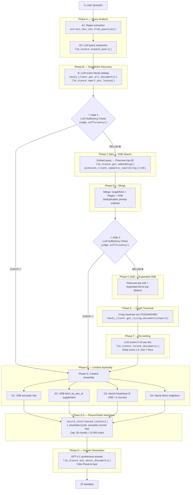

# Search & Discover — Pipeline Documentation

> GraphRAG Legal Document Relationship Explorer  
> Tab 1: "Search & Discover" (Tanya Jawab Regulasi)

---

## Architecture Overview

```
┌─────────────┐    ┌──────────────┐    ┌──────────────────┐    ┌────────────┐
│  Streamlit   │───▶│   Neo4j      │    │   Pinecone       │    │ OpenRouter │
│  (app.py)    │◀───│   Aura       │    │   (VDB)          │    │ (GPT-4.1)  │
│              │───▶│              │    │                  │    │            │
│              │    │ • Documents  │    │ • Indo-LegalBERT │    │ • expand   │
│              │    │ • CITES      │    │   embeddings     │    │ • lookup   │
│              │    │ • HIGHER     │    │ • 1024-dim       │    │ • rerank   │
│              │    │ • Pasal/Ayat │    │ • cosine sim     │    │ • judge    │
│              │───▶│              │───▶│                  │───▶│ • answer   │
└─────────────┘    └──────────────┘    └──────────────────┘    └────────────┘
                                              ▲
                                              │
                                       ┌──────────────┐
                                       │ HuggingFace  │
                                       │ Indo-Legal   │
                                       │ BERT-V3      │
                                       │ (embedding)  │
                                       └──────────────┘
```

**Services:**

| Service | Purpose | Env Var |
|---------|---------|---------|
| Neo4j Aura | Graph DB — documents, citations, hierarchy | `NEO4J_URI`, `NEO4J_USER`, `NEO4J_PASSWORD` |
| Pinecone | Vector DB — semantic search over legal chunks | `PINECONE_API_KEY`, `PINECONE_INDEX` |
| HuggingFace | Embedding endpoint — Indo-LegalBERT-V3 (1024-dim) | `HF_AUTH_TOKEN`, `HF_ENDPOINT_URL` |
| OpenRouter | LLM gateway — GPT-4.1 for reasoning tasks | `OPENROUTER_API_KEY`, `LLM_MODEL` |

---

## Pipeline Flow (with Early-Exit Fallback)



---

## Phase-by-Phase Detail

### Phase A — Query Analysis

| Step | Function | Module | Service | Cost |
|------|----------|--------|---------|------|
| A1: Regex extraction | `extract_doc_ids_from_question(query)` | `benchmark_helpers` | Local | Free |
| A2: LLM expansion | `expand_query(query)` | `llm_stance` | OpenRouter GPT-4.1 | ~250 tokens |

**A1** parses explicit references like "PP 34/2021" → `PP-NASIONAL-34-2021` using 10 regex patterns covering UU, PP, Permen, Perda, Pergub, Perppu, SK Dirjen BK, etc.

**A2** generates 3-5 synonym phrases (e.g., "dividen interim" → "pembagian laba sementara", "distribusi dividen tengah tahun").

### Phase B — GraphRAG Document Discovery

| Function | Module | Service | Cost |
|----------|--------|---------|------|
| `get_all_documents()` | `neo4j_client` | Neo4j Aura | 1 Cypher query (cached 1hr) |
| `smart_doc_lookup(query, all_docs)` | `llm_stance` | OpenRouter GPT-4.1 | ~400 tokens |

LLM examines the **full** Neo4j document catalog (doc_id, judul, jenis, tahun) and picks up to 10 most relevant documents. This bypasses embedding entirely — pure reasoning over metadata.

### Gate 1 — Early-Exit Check

| Function | Module | Service | Cost |
|----------|--------|---------|------|
| `judge_sufficiency(query, doc_ids, summaries)` | `llm_stance` | OpenRouter GPT-4.1 | ~10 tokens output |

**Trigger:** Runs only if Gate 1 has candidate docs AND Neo4j is available.

**Summaries:** Built from Neo4j `get_document_detail()` — Pasal content/titles for up to 10 docs.

**Decision:** LLM responds `CUKUP` or `BELUM`. If `CUKUP` → skip C, D, E, F → jump to Phase G.

**Default on error:** `BELUM` (conservative — proceed with full pipeline).

### Phase C — VDB Semantic Search

**Lite (after Gate 1 fails):**

| Function | Module | Service | Cost |
|----------|--------|---------|------|
| `get_embedding(query)` | `llm_stance` | HuggingFace endpoint | 1 HTTP call |
| `semantic_search(embedding, top_k=30)` | `pinecone_client` | Pinecone | 1 API call |

Returns top-30 chunks, extracts 10 unique doc_ids.

**Full (after Gate 2 fails):**

| Function | Module | Service | Cost |
|----------|--------|---------|------|
| `semantic_search(embedding, top_k=100)` | `pinecone_client` | Pinecone | 1 API call |
| `get_embedding(term)` × 3 | `llm_stance` | HuggingFace | 3 HTTP calls |
| `semantic_search(term_emb, top_k=30)` × 3 | `pinecone_client` | Pinecone | 3 API calls |

Escalates to top-100 + expanded terms (3 terms × top-30 each).

### Phase D — Merge

**Priority order:** GraphRAG picks → Regex-extracted → VDB → Deduplicated.

No external calls — local list operations only.

### Gate 2 — Second Early-Exit Check

Same function as Gate 1. Summaries from VDB chunk content (`semantic_chunks_by_doc`).

If `CUKUP` → skip E, F → jump to Phase G with merged docs (max 7).

### Phase E — Deep Graph Traversal

| Function | Module | Service | Cost |
|----------|--------|---------|------|
| `get_citing_documents(doc_id, hops=2)` × 5 | `neo4j_client` | Neo4j Aura | 5 Cypher queries |

2-hop traversal via `CITES` and `HIGHER` relationships from top-5 merged docs. Discovers regulations the user didn't mention and VDB didn't surface.

### Phase F — Re-ranking

| Function | Module | Service | Cost |
|----------|--------|---------|------|
| `fetch_by_doc_id(did, top_k=3)` per doc | `pinecone_client` | Pinecone | N API calls |
| `get_document_detail(did)` (fallback) | `neo4j_client` | Neo4j | N Cypher queries |
| `rerank_documents(query, summaries)` | `llm_stance` | OpenRouter GPT-4.1 | ~300 tokens |

LLM scores each candidate 0-10. Keep score ≥ 3, max 7 documents. Graph + regex picks are always force-included.

### Phase G — Content Assembly

| Step | Function | Module | Service |
|------|----------|--------|---------|
| G1: VDB semantic hits | (from `semantic_chunks_by_doc`) | — | — |
| G2: VDB supplement | `fetch_by_doc_id(did, top_k=80)` | `pinecone_client` | Pinecone |
| G3: Neo4j Pasal/Ayat | `get_document_detail(did)` | `neo4j_client` | Neo4j |
| G4: Neo4j neighbors | `get_related_documents(did, limit=2)` | `neo4j_client` | Neo4j |

Assembles all available content per document from both VDB and Neo4j.

### Phase G.5 — Round-Robin Interleave

| Function | Module | Location |
|----------|--------|----------|
| `_build_interleaved_context(primary, related, context_docs, max_chunks=30, max_chars=12000)` | `app.py` | Lines ~680-730 |

**Algorithm:**
1. Group all chunks by `doc_id`
2. Per doc: sort by semantic score (scored first, then unscored)
3. Round-robin: take 1 chunk from each doc in turn, cycling through all docs
4. Stop at 30 chunks or 12,000 characters

**Why it matters:** Without this, a document with 50+ chunks fills the entire context window. Other documents are invisible to the LLM. This is critical for multi-document questions.

### Phase H — Answer Generation

| Function | Module | Service | Cost |
|----------|--------|---------|------|
| `ask_about_documents(query, llm_chunks)` | `llm_stance` | OpenRouter GPT-4.1 | ~1500-2000 tokens |

GPT-4.1 synthesizes the answer from interleaved context. Instructed to:
- Answer directly and comprehensively
- Cite specific Pasal & Ayat
- Ignore irrelevant context documents
- Fall back to legal expertise if documents are insufficient

---

## Cost Summary

### Full Pipeline (no early exit)

| Phase | LLM Tokens | API Calls | Latency |
|-------|-----------|-----------|---------|
| A (expand) | ~250 | 1 OpenRouter | 1-3s |
| B (lookup) | ~400 | 1 OpenRouter + 1 Neo4j | 1-5s |
| Gate 1 | ~10 | 1 OpenRouter + ≤10 Neo4j | 1-3s |
| C (full) | — | 1 HF + 4 Pinecone + 3 HF | 3-8s |
| Gate 2 | ~10 | 1 OpenRouter | 1s |
| E (traversal) | — | 5 Neo4j | 1-3s |
| F (rerank) | ~300 | 1 OpenRouter + N Pinecone | 2-5s |
| G (assembly) | — | N Pinecone + N Neo4j | 2-5s |
| H (answer) | ~1500-2000 | 1 OpenRouter | 5-15s |
| **Total** | **~2500-3000** | **~25-40 calls** | **~15-45s** |

### Early Exit at Gate 1

| Phase | LLM Tokens | API Calls | Latency |
|-------|-----------|-----------|---------|
| A (expand) | ~250 | 1 OpenRouter | 1-3s |
| B (lookup) | ~400 | 1 OpenRouter + 1 Neo4j | 1-5s |
| Gate 1 ✅ | ~10 | 1 OpenRouter + ≤10 Neo4j | 1-3s |
| G (assembly) | — | N Pinecone + N Neo4j | 2-5s |
| G.5 (interleave) | — | — | <1ms |
| H (answer) | ~1500-2000 | 1 OpenRouter | 5-15s |
| **Total** | **~2200-2700** | **~15-25 calls** | **~10-30s** |

**Savings:** ~300 tokens, ~10-15 fewer API calls, ~5-15s faster.

### Early Exit at Gate 2

| Phase | LLM Tokens | API Calls | Latency |
|-------|-----------|-----------|---------|
| A + B + Gate 1 ❌ | ~660 | 3 OpenRouter + 11 Neo4j | 3-11s |
| C (lite) | — | 1 HF + 1 Pinecone | 1-3s |
| D (merge) | — | — | <1ms |
| Gate 2 ✅ | ~10 | 1 OpenRouter | 1s |
| G + G.5 + H | ~1500-2000 | N Pinecone + N Neo4j + 1 OpenRouter | 7-20s |
| **Total** | **~2200-2700** | **~18-28 calls** | **~12-35s** |

---

## Module Reference

### `utils/llm_stance.py`

| Function | Signature | Purpose |
|----------|-----------|---------|
| `get_embedding(text)` | `(str) → list[float]` | 1024-dim embedding via Indo-LegalBERT-V3 |
| `expand_query(query)` | `(str) → list[str]` | 3-5 synonym search phrases |
| `smart_doc_lookup(query, all_docs)` | `(str, list[dict]) → list[str]` | LLM picks ≤10 doc_ids from Neo4j catalog |
| `rerank_documents(query, doc_summaries)` | `(str, dict[str,str]) → list[tuple[str,float]]` | LLM scores docs 0-10, sorted descending |
| `judge_sufficiency(query, doc_ids, doc_summaries)` | `(str, list[str], dict[str,str]) → bool` | LLM judges if docs are enough to answer |
| `ask_about_documents(query, context_chunks)` | `(str, list[dict]) → str` | RAG answer generation with Pasal citations |

### `utils/pinecone_client.py`

| Function | Signature | Purpose |
|----------|-----------|---------|
| `semantic_search(query_embedding, top_k, scope_filter)` | `(list[float], int, str?) → list[dict]` | Cosine search in Pinecone index |
| `fetch_by_doc_id(doc_id, top_k)` | `(str, int) → list[dict]` | Fetch all chunks for a specific doc_id |

### `utils/neo4j_client.py`

| Function | Signature | Purpose |
|----------|-----------|---------|
| `get_all_documents()` | `() → list[dict]` | All Document nodes (cached 1hr) |
| `get_document_detail(doc_id)` | `(str) → dict` | Doc + Pasal + Ayat + Diktum |
| `get_related_documents(doc_id, limit)` | `(str, int) → list[dict]` | 1-hop CITES/HIGHER neighbors |
| `get_citing_documents(doc_id, hops)` | `(str, int) → dict` | K-hop expansion via CITES/HIGHER |

### `utils/benchmark_helpers.py`

| Function | Signature | Purpose |
|----------|-----------|---------|
| `extract_doc_ids_from_question(question)` | `(str) → set[str]` | Regex-parse doc references from query text |
| `get_unique_doc_ids(results, max_docs)` | `(list[dict], int) → list[str]` | Unique doc_ids from VDB results |

### `app.py` (helpers)

| Function | Signature | Purpose |
|----------|-----------|---------|
| `_build_interleaved_context(primary, related, context_docs, max_chunks, max_chars)` | `(list, list, dict, int, int) → list[dict]` | Round-robin interleave, 30 chunks / 12k chars |

---

## Early-Exit Decision Logic

```python
# Gate 1: After Phase A + B
if gate1_doc_ids and neo4j_ok:
    summaries = {did: neo4j_pasal_content(did) for did in gate1_doc_ids[:10]}
    if judge_sufficiency(query, gate1_doc_ids, summaries):
        primary_doc_ids = gate1_doc_ids[:7]
        # → skip to Phase G

# Gate 2: After Phase C-lite + D
summaries = {did: vdb_first_chunk(did) for did in merged_doc_ids[:10]}
if judge_sufficiency(query, merged_doc_ids, summaries):
    primary_doc_ids = merged_doc_ids[:7]
    # → skip to Phase G

# Otherwise: full pipeline (C-full → E → F → G → H)
```

**Conservative defaults:**
- `judge_sufficiency()` returns `False` on any error → full pipeline proceeds
- Gate 1 requires Neo4j to be available (summaries come from graph)
- Gate 2 uses VDB chunk content for summaries
- Graph + regex picks are force-included in `primary_doc_ids` on all paths
