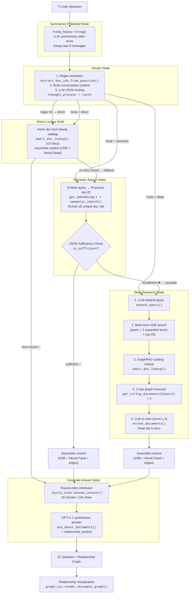

# Search & Discover — Pipeline Documentation

> **App:** `search/` — GraphRAG Legal Document Relationship Explorer  
> Tab 1: "Search & Discover" (Tanya Jawab Regulasi)  
> **v3 — LangGraph Agentic Router + Memory Architecture**

**See Also:**
- [CHATBOT_PIPELINE.md](CHATBOT_PIPELINE.md) — `chatbot/` (multi-turn conversation + hybrid BM25 + persistent memory)
- [KNOWLEDGE_MAP_PIPELINE.md](KNOWLEDGE_MAP_PIPELINE.md) — `knowledge_map/` (visual topic clustering + interactive graph)
- [SEARCH_KM_PIPELINE.md](SEARCH_KM_PIPELINE.md) — `search_km/` (search + knowledge map + conflict detection)

---

## Architecture Overview

```
┌─────────────┐    ┌───────────────────────────────────────────────────────┐
│  Streamlit   │───▶│              LangGraph StateGraph                    │
│  (app.py)    │◀───│  ┌───────────┐  ┌────────┐  ┌──────────┐  ┌──────┐ │
│              │    │  │ Summarize │─▶│ Router │─▶│ Direct / │─▶│ Gen  │ │
│  • stream()  │    │  │IfNeeded   │  │  Node  │  │ Semantic/│  │Answer│ │
│  • thread_id │    │  │ (memory)  │  │        │  │  Deep    │  │ Node │ │
│  • narratives│    │  └───────────┘  └────────┘  └──────────┘  └──────┘ │
└─────────────┘    └───────────────────────────────────────────────────────┘
       │                     │              │              │
       │               ┌─────┴──────┐ ┌─────┴──────┐ ┌────┴─────┐
       │               │ OpenRouter  │ │  Pinecone  │ │  Neo4j   │
       │               │ (Claude)   │ │  (VDB)     │ │  Aura    │
       │               │ • route    │ │ • semantic │ │ • docs   │
       │               │ • suffice  │ │   search   │ │ • CITES  │
       │               │ • rerank   │ │ • fetch    │ │ • HIGHER │
       │               │ • answer   │ │ • 1024-dim │ │ • Pasal  │
       │               │ • summarize│ │            │ │          │
       │               └────────────┘ └────────────┘ └──────────┘
       │                                     ▲
       │                                     │
       │                               ┌──────────────┐
       │                               │ HuggingFace  │
       │                               │ Indo-Legal   │
       │                               │ BERT-V3      │
       │                               │ (embedding)  │
       │                               └──────────────┘
       │
       ▼
┌──────────────────────────────────────────┐
│         Persistence Layer                │
│  ┌──────────────┐  ┌──────────────────┐  │
│  │ SqliteSaver   │  │ SemanticMemory   │  │
│  │ (checkpointer)│  │ (query log,      │  │
│  │ • chat_history│  │  user context,   │  │
│  │ • summary     │  │  conv titles)    │  │
│  │ • thread_id   │  │                  │  │
│  └──────────────┘  └──────────────────┘  │
│            graphrag_memory.db            │
└──────────────────────────────────────────┘
       │
       ▼
┌──────────────────────┐
│  LangSmith (opt.)    │
│  • Tracing           │
│  • Evaluation        │
│  • Prompt Management │
└──────────────────────┘
```

**Services:**

| Service | Purpose | Env Var |
|---------|---------|---------|
| Neo4j Aura | Graph DB — documents, citations, hierarchy | `NEO4J_URI`, `NEO4J_USER`, `NEO4J_PASSWORD` |
| Pinecone | Vector DB — semantic search over legal chunks | `PINECONE_API_KEY`, `PINECONE_INDEX` |
| HuggingFace | Embedding endpoint — Indo-LegalBERT-V3 (1024-dim) | `HF_AUTH_TOKEN`, `HF_ENDPOINT_URL` |
| OpenRouter | LLM gateway — Claude Sonnet for reasoning & routing | `OPENROUTER_API_KEY`, `LLM_MODEL` |
| OpenRouter (Router) | Optional separate model for routing decisions | `LLM_ROUTER_MODEL` (fallback: `LLM_MODEL`) |
| SQLite | Persistence — checkpoints + semantic memory | `graphrag_memory.db` (auto-created) |
| LangSmith (optional) | Observability — tracing, evaluation, prompt hub | `LANGSMITH_API_KEY`, `LANGCHAIN_PROJECT` |
| AWS S3 | Document PDF storage — pre-signed URLs | `AWS_ACCESS_KEY_ID`, `AWS_SECRET_ACCESS_KEY`, `AWS_REGION` |

---

## Pipeline Flow (LangGraph Agentic Router)

The pipeline is implemented as a **LangGraph `StateGraph`** with conditional edges and **persistent memory**. An LLM **Router Node** classifies each query into one of three routes (`direct`, `semantic`, `deep`) and dispatches to the appropriate processing node. Each node can escalate to a heavier route if its results are insufficient.

A **Summarize-If-Needed Node** serves as the entry point, condensing older conversation history to keep the context window manageable while preserving continuity across turns.



### LangGraph State

All nodes share and mutate a single `GraphState` TypedDict:

```python
class GraphState(TypedDict):
    query: str                          # User question
    route: str                          # "direct" | "semantic" | "deep"
    primary_doc_ids: List[str]          # Final document IDs for answer
    context_docs: Dict[str, dict]       # {doc_id: {source, chunks[]}}
    relationship_context: str           # CITES/HIGHER edge text
    answer: str                         # Final generated answer
    logs: List[str]                     # System debug logs
    narratives: List[str]               # User-facing legal explanations (Indonesian)
    chat_history: List[dict]            # [{role: "user"|"assistant", content: str}]
    summary: str                        # Condensed older conversation history
    user_context: str                   # Injected semantic memory context
```

**Memory fields explained:**
- `chat_history` — rolling window of recent user/assistant turns (kept at most ~6 messages via summarization)
- `summary` — LLM-condensed summary of older turns (generated when `chat_history > 6`)
- `user_context` — auto-generated string from `SemanticMemory` describing frequent topics & docs the user has asked about

### Graph Edges (Routing Logic)

```python
workflow = StateGraph(GraphState)

# Nodes (6 total)
workflow.add_node("summarize_if_needed", summarize_if_needed_node)
workflow.add_node("router", router_node)
workflow.add_node("direct_lookup", direct_lookup_node)
workflow.add_node("semantic_search", semantic_search_node)
workflow.add_node("deep_research", deep_research_node)
workflow.add_node("generate_answer", generate_answer_node)

# Entry — summarize first, then route
workflow.set_entry_point("summarize_if_needed")
workflow.add_edge("summarize_if_needed", "router")

# Router → one of three nodes
workflow.add_conditional_edges("router", router_condition)
#   "direct"   → direct_lookup
#   "semantic"  → semantic_search
#   "deep"      → deep_research

# Direct → answer OR fallback to semantic
workflow.add_conditional_edges("direct_lookup", route_after_direct)

# Semantic → answer OR escalate to deep
workflow.add_conditional_edges("semantic_search", route_after_semantic)

# Deep always → answer
workflow.add_edge("deep_research", "generate_answer")
workflow.add_edge("generate_answer", END)

# Optional checkpointer for conversation persistence
compile_kwargs = {}
if checkpointer is not None:
    compile_kwargs["checkpointer"] = checkpointer
return workflow.compile(**compile_kwargs)
```

---

## Node-by-Node Detail

### Summarize-If-Needed Node — `summarize_if_needed_node()`

| Step | Function | Module | Service | Cost |
|------|----------|--------|---------|------|
| 1. Check history length | `len(chat_history) > 6` | `langgraph_agent` | Local | Free |
| 2. Summarize older turns | `summarize_conversation(chat_history, existing_summary)` | `llm_stance` | OpenRouter | ~300 tokens |

**Entry point** of the graph. Runs before every query to manage conversation context window:
- If `chat_history` has ≤ 6 messages, passes through unchanged
- If > 6 messages, calls `summarize_conversation()` to condense older turns into 3-5 sentences (Indonesian)
- Keeps the last 4 messages intact for immediate context
- Updates `summary` field in state

This prevents unbounded context growth while maintaining conversation continuity.

### Router Node — `router_node()`

| Step | Function | Module | Service | Cost |
|------|----------|--------|---------|------|
| 1. Regex extraction | `extract_doc_ids_from_question(query)` | `benchmark_helpers` | Local | Free |
| 2. LLM route decision | `client.chat.completions.create()` | `llm_stance` | OpenRouter | ~250 tokens |

**Step 1:** Parses explicit references like "PP 34/2021" → `PP-NASIONAL-34-2021` using 10 regex patterns. If a regex hit is found, the route is immediately set to `"direct"` without calling the LLM.

**Step 2:** If no regex hit, the LLM receives the query **plus conversation context** (summary + recent turns from `_build_history_context()`) and returns a **JSON object** with two keys:

```json
{
  "thought_process": "Saya sedang menganalisis apakah pertanyaan ini ...",
  "route": "direct | semantic | deep"
}
```

**Route classification:**

| Route | When | Example Queries |
|-------|------|-----------------|
| `direct` | Asking about a specific pasal/UU by name | "Apa isi Pasal 5 UU 40/2007?" |
| `semantic` | General concept or standard rule lookup | "Apa syarat pembagian dividen interim?" |
| `deep` | Complex analysis: conflicts, harmony, exceptions, legal history between multiple laws | "Apakah UU Cipta Kerja mengubah ketentuan PHK di UU Ketenagakerjaan?" |

**Narrative:** The `thought_process` field is streamed live to the user as a lawyer-like explanation (in Indonesian). No technical terms like "vector DB" are exposed.

**Fallback:** On any error, defaults to `"semantic"`.

### Direct Lookup Node — `direct_lookup_node()`

| Function | Module | Service | Cost |
|----------|--------|---------|------|
| `get_all_documents()` | `neo4j_client` | Neo4j Aura | 1 Cypher query (cached 1hr) |
| `smart_doc_lookup(query, all_docs)` | `llm_stance` | OpenRouter GPT-4.1 | ~400 tokens |
| `_assemble_context_for_state()` | `langgraph_agent` | Neo4j + Pinecone | N queries |

1. If `primary_doc_ids` is empty (no regex hits), uses `smart_doc_lookup()` to pick ≤3 docs from the Neo4j catalog.
2. If still no docs found, **falls back to `semantic`** route.
3. Otherwise, assembles context (VDB chunks + Neo4j Pasal/Ayat + graph edges) and proceeds to answer.

**Narrative:** "Saya telah menemukan dokumen yang tepat, dan sedang membaca ketentuannya..."

### Semantic Search Node — `semantic_search_node()`

| Step | Function | Module | Service | Cost |
|------|----------|--------|---------|------|
| 1. VDB search | `get_embedding()` + `semantic_search(top_k=20)` | `llm_stance` / `pinecone_client` | HF + Pinecone | 2 API calls |
| 2. Sufficiency check | `client.chat.completions.create()` | `llm_stance` | OpenRouter | ~250 tokens |
| 3. Context assembly | `_assemble_context_for_state()` | `langgraph_agent` | Neo4j + Pinecone | N queries |

**Step 1:** Embeds the query and searches Pinecone for top-20 results. Extracts ≤5 unique doc_ids.

**Step 2 — JSON Sufficiency Check:** The LLM receives retrieved excerpts and returns:

```json
{
  "thought_process": "Konteks awal telah ditemukan, namun saya merasa perlu memverifikasi ...",
  "is_sufficient": true | false
}
```

The `thought_process` is streamed as a narrative. If `is_sufficient` is `false`, the route is escalated to `"deep"`.

**Step 3:** If sufficient, assembles full context and proceeds to answer generation.

**Fallback:** On VDB error or sufficiency check error, **escalates to `deep`** (conservative).

### Deep Research Node — `deep_research_node()`

| Step | Function | Module | Service | Cost |
|------|----------|--------|---------|------|
| 1. Query expansion | `expand_query(query)` | `llm_stance` | OpenRouter | ~250 tokens |
| 2. Multi-term VDB | `get_embedding()` × 3 + `semantic_search(top_k=25)` × 3 | `llm_stance` / `pinecone_client` | HF + Pinecone | 6 API calls |
| 3. Graph catalog | `get_all_documents()` + `smart_doc_lookup()` | `neo4j_client` / `llm_stance` | Neo4j + OpenRouter | ~400 tokens |
| 4. 2-hop traversal | `get_citing_documents(hops=2)` × 3 | `neo4j_client` | Neo4j | 3 Cypher queries |
| 5. Re-ranking | `rerank_documents(query, doc_summaries)` | `llm_stance` | OpenRouter | ~300 tokens |
| 6. Context assembly | `_assemble_context_for_state()` | `langgraph_agent` | Neo4j + Pinecone | N queries |

**Step 1:** Generates 3-5 synonym phrases (e.g., "dividen interim" → "pembagian laba sementara").

**Step 2:** Searches VDB with original query + 2 expanded terms (25 results each). Deduplicates across all results. Extracts ≤10 unique doc_ids.

**Step 3:** LLM scans the full Neo4j document catalog and picks relevant docs. Merges with VDB doc_ids.

**Step 4:** For the top-3 merged docs, performs 2-hop graph traversal via `CITES` and `HIGHER` relationships. Discovers regulations the user didn't mention and VDB didn't surface.

**Step 5:** LLM scores all candidates 0-10. Keeps docs with score ≥ 3, max 5. Falls back to top-5 merged if none pass.

**Step 6:** Assembles full context.

**Narrative:** "Sistem melakukan penelusuran hukum secara ekstensif (historis dan relasi regulasi) untuk memastikan keakuratan..."

### Context Assembly — `_assemble_context_for_state()`

Shared helper called by all processing nodes. For each doc in `primary_doc_ids`:

| Source | Data | Dedup |
|--------|------|-------|
| VDB semantic hits | Raw hits passed via `raw_vdb_hits` param | By chunk `id` via `seen_chunk_ids` |
| Neo4j Pasal/Ayat | `get_document_detail(did)` → pasals + ayats | By `neo-{did}-{pid}` synthetic ID |
| Graph edges | `get_edges_between(doc_ids)` → CITES/HIGHER | Appended to `relationship_context` |

Neo4j Pasal/Ayat content is **always** fetched for all primary documents. A `seen_chunk_ids` set deduplicates Neo4j chunks against VDB chunks already present.

### Generate Answer Node — `generate_answer_node()`

| Step | Function | Module | Service | Cost |
|------|----------|--------|---------|------|
| 1. Interleave context | `_build_interleaved_context()` | `langgraph_agent` | Local | Free |
| 2. Generate answer | `ask_about_documents(query, chunks, rel_ctx, chat_history, summary, user_context)` | `llm_stance` | OpenRouter | ~1500-2000 tokens |
| 3. Update chat history | Append user query + truncated answer to `chat_history` | `langgraph_agent` | Local | Free |

**Step 1 — Round-Robin Interleave:**
1. Group all chunks by `doc_id`
2. Per doc: sort by semantic score (scored first, then unscored)
3. Round-robin: take 1 chunk from each doc in turn
4. Stop at **30 chunks** or **12,000 characters**

**Step 2 — Answer Generation:** The LLM synthesizes the answer from interleaved context + relationship graph. The prompt now includes:
- **Conversation history section** (`[Riwayat Percakapan]`): summary + last 6 messages for continuity
- **User context section** (`[Konteks Pengguna]`): frequent topics/docs from SemanticMemory
- **Anti-"Tidak" bias guard:** Prevents the LLM from defaulting to "No" on regulatory relationship questions
- **Relationship awareness:** Uses CITES/HIGHER edges to infer connections between regulations
- **Exception/limitation checking:** Checks for exception clauses
- Start with firm conclusion, cite specific Pasal & Ayat

**Step 3 — History Update:** After generating the answer, appends the current user query and a truncated version of the answer (500 chars) to `chat_history` in the state. This enables the next turn's `summarize_if_needed` and `router` nodes to leverage conversation context.

### Relationship Visualization (UI only)

| Function | Module | Service |
|----------|--------|---------|
| `render_document_graph(nodes, edges)` | `graph_viz` | Local |

After the answer is displayed, an interactive graph visualization shows the **subgraph** of documents used in the answer and their CITES/HIGHER relationships.

---

## Streamlit Integration (app.py)

The LangGraph agent is executed via `agent.stream()` with **thread-based checkpointing** and **semantic memory**:

```python
from utils.langgraph_agent import create_agent
from utils.memory import SemanticMemory
from langgraph.checkpoint.sqlite import SqliteSaver
import sqlite3

# Persistence (module-level, shared across reruns)
conn = sqlite3.connect("graphrag_memory.db", check_same_thread=False)
checkpointer = SqliteSaver(conn)
memory = SemanticMemory("graphrag_memory.db")

# Per-query execution
agent = create_agent(checkpointer=checkpointer)
user_ctx = memory.get_user_context_prompt()

for event in agent.stream(
    {
        "query": query,
        "logs": [], "narratives": [], "primary_doc_ids": [],
        "chat_history": st.session_state.chat_history,
        "summary": st.session_state.summary,
        "user_context": user_ctx,
    },
    config={"configurable": {"thread_id": st.session_state.active_conv_id}},
):
    for node_name, state_update in event.items():
        final_state.update(state_update)
        # Stream new narratives live to user
        for nar in state_update.get("narratives", [])[seen_narratives:]:
            st.markdown(f"💭 *{nar}*")

# After answer: log to semantic memory
memory.log_query(query=prompt, doc_ids=cited_ids, route=route, latency=latency)
memory.save_conversation_title(conv_id, title)
```

### Memory Architecture

| Scope | Storage | Purpose | Lifecycle |
|-------|---------|---------|----------|
| Conversation Memory | LangGraph SqliteSaver (checkpointer) | `chat_history` per thread_id | Persists across browser reloads |
| Summary Memory | `summary` field in GraphState | Condensed older turns (>6 msgs) | Updated each turn by `summarize_if_needed` |
| Semantic Memory | `SemanticMemory` SQLite tables | Query log, frequent topics/docs, user preferences | Persists forever |
| Cross-Session Memory | `conv_title:*` keys in semantic_memory table | Sidebar conversation history | Persists forever |

**Single SQLite file:** Both `SqliteSaver` (checkpointer tables) and `SemanticMemory` (query_log, semantic_memory tables) share `graphrag_memory.db`.

### LangSmith Integration (optional)

```python
from utils.langsmith_config import init_langsmith
init_langsmith()  # No-op if LANGSMITH_API_KEY not set
```

- **Tracing:** All LangGraph runs are traced when API key is present
- **Graceful degradation:** App works identically without LangSmith
- **Environment variables:** `LANGSMITH_API_KEY`, `LANGCHAIN_PROJECT` (default: `graphrag-legal`)

**Narrative UI:** Each node appends Indonesian-language "thoughts" to `state["narratives"]`. These are rendered live in the Streamlit UI as the pipeline progresses, giving the user insight into the legal reasoning without exposing technical details.

**Debug Logs:** Raw system logs are available in an expandable `⚙️ Catatan Teknis` section.

---

## Cost Summary

### Direct Route (regex hit or simple lookup)

| Node | LLM Tokens | API Calls | Latency |
|------|-----------|-----------|---------|
| Router (regex hit) | 0 | 0 | <1ms |
| Direct Lookup | ~400 | 1 OpenRouter + 1 Neo4j | 1-5s |
| Context Assembly | — | N Neo4j + N Pinecone | 1-3s |
| Generate Answer | ~1500-2000 | 1 OpenRouter | 5-15s |
| **Total** | **~1900-2400** | **~5-15 calls** | **~7-23s** |

### Semantic Route (sufficient at first check)

| Node | LLM Tokens | API Calls | Latency |
|------|-----------|-----------|---------|
| Router | ~250 | 1 OpenRouter | 1-3s |
| Semantic Search | — | 1 HF + 1 Pinecone | 1-3s |
| Sufficiency Check | ~250 | 1 OpenRouter | 1-3s |
| Context Assembly | — | N Neo4j | 1-3s |
| Generate Answer | ~1500-2000 | 1 OpenRouter | 5-15s |
| **Total** | **~2000-2500** | **~8-20 calls** | **~9-27s** |

### Semantic → Deep Escalation

| Node | LLM Tokens | API Calls | Latency |
|------|-----------|-----------|---------|
| Router | ~250 | 1 OpenRouter | 1-3s |
| Semantic (insufficient) | ~250 | 1 HF + 1 Pinecone + 1 OpenRouter | 2-6s |
| Deep Research | ~950 | 3 HF + 3 Pinecone + 1 OpenRouter + 3 Neo4j + 1 OpenRouter | 5-15s |
| Context Assembly | — | N Neo4j | 1-3s |
| Generate Answer | ~1500-2000 | 1 OpenRouter | 5-15s |
| **Total** | **~2950-3450** | **~20-35 calls** | **~14-42s** |

### Deep Route (directly routed)

| Node | LLM Tokens | API Calls | Latency |
|------|-----------|-----------|---------|
| Router | ~250 | 1 OpenRouter | 1-3s |
| Deep Research | ~950 | 3 HF + 3 Pinecone + 1 Neo4j + 1 OpenRouter + 3 Neo4j + 1 OpenRouter | 5-15s |
| Context Assembly | — | N Neo4j | 1-3s |
| Generate Answer | ~1500-2000 | 1 OpenRouter | 5-15s |
| **Total** | **~2700-3200** | **~18-30 calls** | **~12-36s** |

---

## Module Reference

### `utils/langgraph_agent.py`

| Function | Signature | Purpose |
|----------|-----------|---------|
| `summarize_if_needed_node(state)` | `(GraphState) → GraphState` | Condense chat_history if >6, update summary |
| `router_node(state)` | `(GraphState) → GraphState` | Regex + history context + LLM JSON routing → sets `route` |
| `direct_lookup_node(state)` | `(GraphState) → GraphState` | Neo4j catalog lookup, fallback to semantic |
| `semantic_search_node(state)` | `(GraphState) → GraphState` | VDB top-20 + JSON sufficiency check, escalate to deep |
| `deep_research_node(state)` | `(GraphState) → GraphState` | Expand + multi-VDB + graph traversal + rerank |
| `generate_answer_node(state)` | `(GraphState) → GraphState` | Interleave + LLM answer + update chat_history |
| `_build_history_context(state)` | `(GraphState) → str` | Build compact context from summary + last 6 messages |
| `_assemble_context_for_state(state, raw_vdb_hits)` | `(GraphState, list?) → GraphState` | Shared: VDB + Neo4j Pasal + edges assembly |
| `_build_interleaved_context(primary, related, context_docs, max_chunks, max_chars)` | `(list, list, dict, int, int) → list[dict]` | Round-robin interleave, 30 chunks / 12k chars |
| `create_agent(checkpointer)` | `(BaseCheckpointSaver?) → CompiledGraph` | Build & compile with optional checkpointer |

### `utils/llm_stance.py`

| Function | Signature | Purpose |
|----------|-----------|---------|
| `get_embedding(text)` | `(str) → list[float]` | 1024-dim embedding via Indo-LegalBERT-V3 |
| `get_llm_client()` | `() → OpenAI` | Returns OpenRouter client instance |
| `expand_query(query)` | `(str) → list[str]` | 3-5 synonym search phrases |
| `smart_doc_lookup(query, all_docs)` | `(str, list[dict]) → list[str]` | LLM picks ≤10 doc_ids from Neo4j catalog |
| `rerank_documents(query, doc_summaries)` | `(str, dict[str,str]) → list[tuple[str,float]]` | LLM scores docs 0-10, sorted descending |
| `ask_about_documents(query, chunks, rel_ctx, chat_history, summary, user_context)` | `(str, list, str, list?, str, str) → str` | RAG answer with conversation context + user memory |
| `summarize_conversation(chat_history, existing_summary)` | `(list[dict], str) → str` | Condense conversation to 3-5 sentences (Indonesian) |

### `utils/pinecone_client.py`

| Function | Signature | Purpose |
|----------|-----------|---------|
| `semantic_search(query_embedding, top_k, scope_filter)` | `(list[float], int, str?) → list[dict]` | Cosine search in Pinecone index |
| `fetch_by_doc_id(doc_id, top_k)` | `(str, int) → list[dict]` | Fetch all chunks for a specific doc_id |

### `utils/neo4j_client.py`

| Function | Signature | Purpose |
|----------|-----------|---------|
| `test_connection()` | `() → bool` | Check if Neo4j is reachable |
| `get_all_documents()` | `() → list[dict]` | All Document nodes (cached 1hr) |
| `get_document_detail(doc_id)` | `(str) → dict` | Doc + Pasal + Ayat + Diktum |
| `get_related_documents(doc_id, limit)` | `(str, int) → list[dict]` | 1-hop CITES/HIGHER neighbors |
| `get_citing_documents(doc_id, hops)` | `(str, int) → dict` | K-hop expansion via CITES/HIGHER |
| `get_edges_between(doc_ids)` | `(list[str]) → dict` | CITES/HIGHER edges between given docs |

### `utils/benchmark_helpers.py`

| Function | Signature | Purpose |
|----------|-----------|---------|
| `extract_doc_ids_from_question(question)` | `(str) → set[str]` | Regex-parse doc references from query text |
| `get_unique_doc_ids(results, max_docs)` | `(list[dict], int) → list[str]` | Unique doc_ids from VDB results |

### `utils/memory.py`

| Function / Class | Signature | Purpose |
|------------------|-----------|---------|
| `SemanticMemory(db_path)` | `(str) → SemanticMemory` | SQLite-backed query log & user context |
| `.log_query(query, doc_ids, topic, route, latency)` | `(str, list?, str, str, float) → None` | Log each answered query |
| `.get_recent_queries(n)` | `(int) → list[dict]` | Last N queries with metadata |
| `.get_frequent_topics(n)` | `(int) → list[str]` | Most common query topics |
| `.get_frequent_docs(n)` | `(int) → list[str]` | Most referenced doc_ids |
| `.get_user_context_prompt()` | `() → str` | Build LLM-injectable user context string |
| `.set/get_preference(key, value)` | `(str, str) → None/str` | Arbitrary key-value preferences |
| `.save_conversation_title(conv_id, title)` | `(str, str) → None` | Persist conversation title for sidebar |
| `.get_all_conversation_titles()` | `() → list[dict]` | All saved conversations (for sidebar history) |

### `utils/langsmith_config.py`

| Function | Signature | Purpose |
|----------|-----------|---------|
| `init_langsmith()` | `() → bool` | Activate LangSmith tracing if API key set |
| `get_traceable()` | `() → Callable` | Return `@traceable` decorator or no-op |

---

## Routing & Escalation Logic

```python
# Router Node
regex_ids = extract_doc_ids_from_question(query)
if regex_ids:
    route = "direct"  # Immediate — skip LLM routing
else:
    route = LLM_JSON_response["route"]  # "direct" | "semantic" | "deep"

# Direct Node — fallback
if no_docs_found:
    route = "semantic"  # Escalate

# Semantic Node — sufficiency gate
if not LLM_JSON_response["is_sufficient"]:
    route = "deep"  # Escalate

# Deep Nodpip3 install langgraph && python3 -m streamlit run app.pypip3 install langgraph && python3 -m streamlit run app.pye — always proceeds to answer
# (no further escalation possible)
```

**Key design principles:**
- **Escalation only, never downgrade:** `direct` → `semantic` → `deep` (never backwards)
- **Conservative defaults:** Any LLM/API error triggers escalation (not a silent pass)
- **JSON Chain-of-Thought:** Router and sufficiency checks return structured JSON with `thought_process` for narrative UI
- **Narrative transparency:** Every node appends human-readable Indonesian explanations to `state["narratives"]`, streamed live to the user

---

## Migration from v1 (Linear Pipeline)

| v1 (Linear Pipeline) | v2 (LangGraph Agentic Router) | v3 (+ Memory & Observability) |
|-----------------------|-------------------------------|-------------------------------|
| Phase A→B→Gate1→C→D→Gate2→E→F→G→H | Router → Direct/Semantic/Deep → Answer | Summarize → Router → Direct/Semantic/Deep → Answer |
| `judge_sufficiency()` returns `CUKUP`/`BELUM` | JSON `{"is_sufficient": bool, "thought_process": "..."}` | Same + robust JSON fallback (regex extraction) |
| 2 gates (hardcoded positions) | 1 sufficiency check (in Semantic node only) | Same |
| All logic in `app.py` (~350 lines) | Logic in `utils/langgraph_agent.py` (~350 lines) | + `utils/memory.py`, `utils/langsmith_config.py` |
| No user-facing reasoning | Live narrative streaming ("Saya sedang menganalisis...") | + conversation context in routing |
| `_build_interleaved_context()` in `app.py` | `_build_interleaved_context()` in `langgraph_agent.py` | Same |
| 40 chunks / 16k chars cap | 30 chunks / 12k chars cap | Same |
| Gate 1: Neo4j summaries, Gate 2: VDB summaries | Single JSON sufficiency check with VDB excerpts | Same |
| Fixed `top_k=30` (lite) / `top_k=100` (full) | `top_k=20` (semantic) / `top_k=25×3` (deep) | Same |
| Max 7 primary docs | Max 5 primary docs (deep) / 3 (direct) / 5 (semantic) | Same |
| No persistence | No persistence (session_state only) | SQLite persistence + LangGraph checkpointer |
| No memory | No memory | 4-scope memory (conversation, summary, semantic, cross-session) |
| No observability | No observability | LangSmith tracing (optional) |
